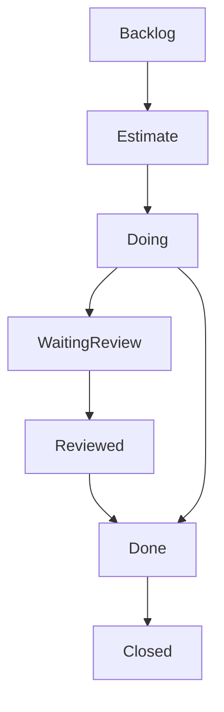
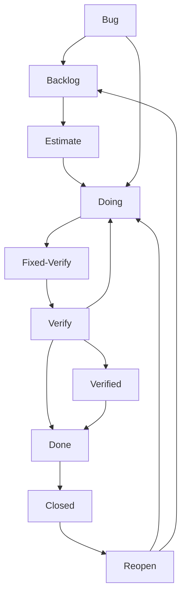
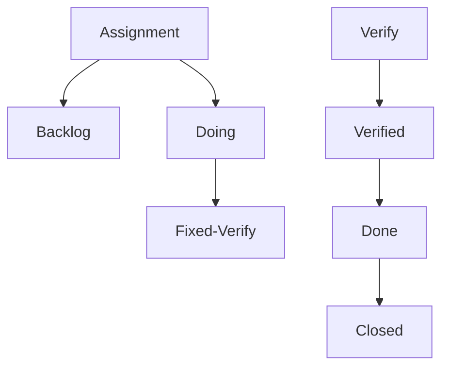

## Life Cycles

# General Issue Life Cycle

```mermaid
graph TD;
    Backlog-->Estimate;
    Estimate-->Doing;
    Doing-->WaitingReview;
    WaitingReview-->Reviewed;
    Reviewed-->Done
    Doing-->Done;
    Done-->Closed
```

# Bug Issue Life Cycle

```mermaid
graph TD;
    Bug-->Backlog;
    Backlog-->Estimate;
    Estimate-->Doing;
    Bug-->Doing;
    Doing-->Fixed-Verify;
    Verify-->Verified;
    Fixed-Verify-->Verify;
    Verify-->Doing;
    Verify-->Done;
    Verified-->Done;
    Done-->Closed;
    Closed-->Reopen;
    Reopen-->Doing;
    Reopen-->Backlog;
```

# Assignment Issue Life Cycle

```mermaid
graph TD;
    Assignment-->Backlog;
    Assignment-->Doing;
    Doing-->Fixed-Verify;
    Verify-->Verified;
    Verified-->Done;
    Done-->Closed;
```
