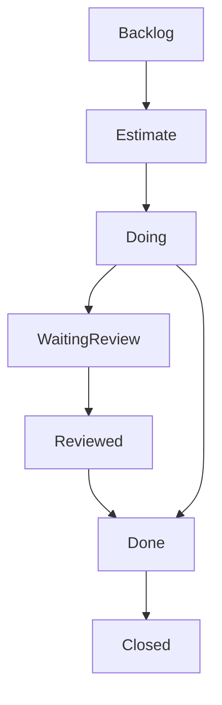

# OPF Issue types-and-labels

| Issue type | Current Label Color | Offical Color | Purpose |
|:-:|:-:|:-:|:-:|
| Personal | ~"Personal" | `#44AD8E` | Personal task for student | 
| Team | ~"Team" | `#44AD8E` | Team task for student team |    

# Issue Types

	
In English
		
| Issue type | Current Label Color | Offical Color | Purpose |
|:-:|:-:|:-:|:-:|
| [bug-report.md](issue_templates/bug-report.md) | ~"Bug" | `#FF0000` | Issue used for bug report |
| [incident-report.md](issue_templates/incident-report.md) | ~"Incident" | `#FF0000` | Issue used for incident report |     
| [design-task.md](issue_templates/design-task.md) | ~"Design" |`#1D5299` | Issue to describe design task |
| [general-task.md](issue_templates/general-task.md) |  ~"General"   | `#1D5299` | Issue for general purpose  | 
| [implementation-task.md](issue_templates/implementation-task.md) | ~"Implementation" | `#1D5299` | Issue to describe coding etc.. |
| [documentation-task.md](issue_templates/documentation-task.md) | ~"Documentation" | `#1D5299` | Issue to describe documentation |
| [question-and-answer.md](issue_templates/question-and-answer.md) | ~"Q&A" | `#1D5299` | Question and Answer issue |
| [User Story.md](issue_templates/user-story.md) | ~"User Story" | `#1D5299` | User Story issue |
| [Job Story.md](issue_templates/job-story.md)  | ~"Job Story" | `#1D5299` | Job Story issue |
| [Assignment](issue_templates/assignment.md)) | ~"Assignment" | `#2B7BE5` | General assignment for student |

Suomeksi

| Issue type | Current Label Color | Offical Color | Tarkoitus |
|:-:|:-:|:-:|:-:|
| vika-raportti.md | ~"Bug"  | `#FF0000` | Issue, jonka avulla raportoidaan vikoja |
| poikkeama-raportti.md | ~"Incident" | `#FF0000` | Issue, jonka avulla raportoidaan poikkeamia esim. katselmointi |
| suunnittelu-tehtävä.md | ~"Design" | `#1D5299` | Issue, jolla kuvataan suunnittelutehtävä |
| yleinen-tehtävä.md | ~"General" | `#1D5299` ||
| toteutus-tehtävä.m | ~"Implementation" | `#1D5299` ||
| Dokumentointi-tehtävä.md | ~"Documentation" | `#1D5299` ||
| kysymys-ja-vastaus.md | ~"Q&A" | `#1D5299` ||
| Käyttäjätarina.md | ~"User Story"  | `#1D5299` ||
| harjoitustehtava.md  | ~"Assignment" | `#2B7BE5` ||

# Issue State Labels

| Issue type | Current Label Color | Offical Color | Purpose  |
|:-:|:-:|:-:|:-:|
| Backlog | ~"Backlog" | `#F0A921` | Issue waiting in the Backlog |
| Estimate | ~"Estimate" | `#F0A921` | Issue in estimation phase |
| Doing | ~"Doing" | `#F0A921` | Issue under work |
| Fixed Verify | ~"Fixed Verify" | `#9E760D` | Bug report issue which is fixed by coder |
| Verified | ~"Verified" | `#69D121` | Bug report issue which is verified by tester/coder |
| Waiting Review | ~"Waiting Review" | `#F0A921` | Issue waiting for general review |
| Reviewed | ~"Reviewed" | `#69D121` | Issue which has passed review |
| Done | ~"Done" | `#29510D` | Issue which is done and reviewed |

Reserved Labels for future:

# General Issue Life Cycle

