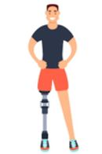

# Profiili - 1

### viiteryhmä/segmentti:

* Asiakas
* Potilas

### Persoona/sidosryhmän kuvaus

**Nimi ja taustaa**

Nimeni on Asiakas x, olen kävelykuntoutusterapian asiakas.

### Motiivi käyttää/soveltaa palvelua? 

* Käyn kävelykuntoutusterapiassa harjoittelemassa proteesin käyttöä.
* Tavoitteena on tottua proteesin käyttöön ja uuden elämäntilanteeseen oppiminen
* Tavoitteena on oppia kävelemään jalkaproteesilla.
* Pystyykö kävelykuntoutusrobotti huomioimaan proteesi-potilaiden tarpeita kävelykuntoutusterapiassa?
* Voiko halvaantunut potilas hyödyntää robottia?
* Ottaako robotti huomioon motorista sairautta sairastavan potilaan?

### Arvot  

* Haluan laitteen, joka huomioi uuden elämän tilanteeni ja pystyy antamaan sopivaa tukea harjoittelussa.
* Toivon sen auttavan minua kohtaamaan eri liikkumisen tilanteita, joita arkielämässä kohtaa.
* Toivon, että laite ottaa huomioon liikuntarajoitukseni.
* I do not understand Finnish, what is it instructing me to do?
* Olen sokea, onko laite helposti hahmtoteltavissa?
* Toivottavasti laite pystyy näyttämään mitä tehdä, olen kuuro.

### Välineet ja kyvyt etc.

* Proteesi, kuten jalkaproteesi.
* Rollaattori.
* Muu liikkumista tukeva ja laitteen käyttöä rajoittava väline.
* Ulkomaalainen.
* Värisokea.
* Sokea.
* Kuuro.
* Motorinen sairaus.