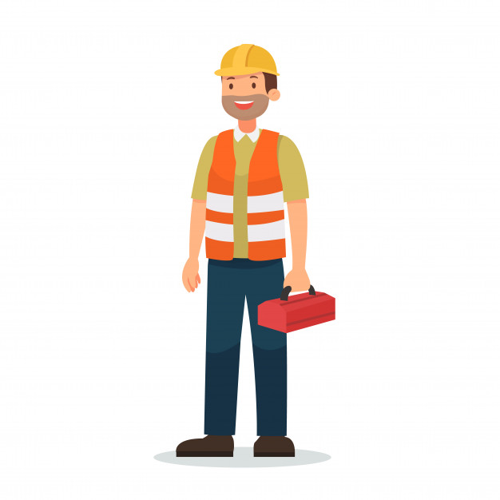

# Profiili - 8

### viiteryhmä/segmentti:

* Teknikko/huoltaja/korjaaja

### Persoona/sidosryhmän kuvaus

**Nimi ja taustaa**

Hei, olen henkilo T! Minun työtäni on laitteiden huolto, korjaus ja fyysisen puolen ylläpito.

### Motiivi käyttää/soveltaa palvelua? 

* Työ.
* Huolto.
* Korjaus.
* Ylläpito.

### Arvot  

* Laitteen tulee olla toimintakunnossa.
* Laite ei saa aiheuttaa vaaroja.
* Laitteen pitää olla hyvin huollettu ja säännöllisesti huoltaa.

### Välineet ja kyvyt etc.

* Tekniset taidot, huolto, korjaus, fysiikka, elektroniikka, sähkötekniikka, ammattitason työkalupakki.