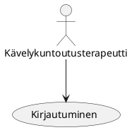

 Use Case - 1: Kirjautuminen

**Info**

* Laatija: M3268
* Versio 1.0.0.1
* Kävelykuntoutusterapeutti käyttötapaus.
	
**Käyttäjäroolit**	

1. Kävelykuntoutusterapeutti.
2. Operaattori/käyttäjä.
3. Palautteen antaja.

**Esitiedot/ehdot**	

1. Kävelykuntoutusrobotti hyväksytään läpi ja julkaistaan tuote.
2. Kävelykuntoutusrobottia käytetään osana kävelykuntoutusterapiaa
3. Tuotetta jatkokehitetään.

**Käyttötapauksen kuvaus**

1. Tuote julkaistaan.
2. Kävelykuntoutusrobottiin syötetään kävelykuntoutusterapeuttien käyttäjätietoja.
3. Jos syöte on oikea, kirjaudutaan sisään.
4. Käytetään kävelykuntoutusrobotin ohjelmistoa osana kävelykuntoutusterapiaa.
5. Ennen lopetusta tallennetaan halutut tiedot ja varmistetaan vielä ennen tallennusta.
6. Lopetetaan istunto.
7. Kirjaudutaan ulos.

**Poikkeukset**
 
* P1 - Lopettaa tuotteen käytön jos kävelykuntoutusrobotti ei toimi tarvitulla tavalla.	

* P2 - Lopettaa tuotteen käytön jos se tarvitsee huoltoa.

* P3 - Ei käytä tuotetta jos ohjelmistossa on joku vika ja sisäänkirjautuminen ei toimi. 
	
**Lopputulos**	

* Kirjaa käyttäjätiedot, kirjautuu sisään ja alkaa käyttämään kävelykuntoutusrobottia osana kävelykuntoutusta.

**Käyttötiheys** 

* Käyttötapaus vastaa kirjautumista.

**Muuta**	

* Kuvataan muita käyttötapaukseen liittyviä oleellisia tietoja, kuten avoimia asioita, viittauksia käytettäviin koodistoihin jne.

**Lähteet**

Tämä wiki-dokumentin runko pohjautuu [Julkisenhallinnon suosituksiin](http://www.jhs-suositukset.fi/web/guest/jhs/recommendations/173)

Kiitokset alkuperäisen tekijöille!