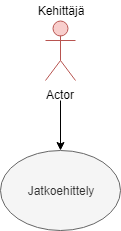

 Use Case - 1: Kirjautuminen

**Info**

* Laatija: M3268
* Versio 1.0.0.1
* Kävelykuntoutusterapeutti käyttötapaus.
	
**Käyttäjäroolit**	

1. Kehittäjä
2. Insinööri.
3. Projektivastaava.

**Esitiedot/ehdot**	

1. Kävelykuntoutusrobotti hyväksytään läpi ja julkaistaan tuote.
2. Tuotetta jatkokehitetään.

**Käyttötapauksen kuvaus**

1. Tuote julkaistaan.
2. Asiakaskuuleminen palautteesta.
3. Selvitetään jatkokehityksen tarpeet.
4. Dokumentoidaan tiedot.
5. Haetaan resurssit ja tehdään sopimus jatkokehittämiselle.
6. Jatkokehtietään

**Poikkeukset**
 
* P1 - Lopettaa tuotteen jatkokehityksen jos ei ole enää kehitettävää.	

* P2 - Lopettaa tuotteen jatkokehityksen jos ei saa resursseja jatkokehitykseen ja sopimuksia laadittua.

* P3 - Lopettaa tuotteen jatkokehityksen jos tarve on siirtyä toisen projektin pariin.
	
**Lopputulos**	

* Jatkokehitystä tehdään tarpeen mukaan.

**Käyttötiheys** 

* Käyttötapaus vastaa jatkokehitystä.

**Muuta**	

* Kuvataan muita käyttötapaukseen liittyviä oleellisia tietoja, kuten avoimia asioita, viittauksia käytettäviin koodistoihin jne.

**Lähteet**

Tämä wiki-dokumentin runko pohjautuu [Julkisenhallinnon suosituksiin](http://www.jhs-suositukset.fi/web/guest/jhs/recommendations/173)

Kiitokset alkuperäisen tekijöille!