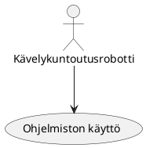

Use Case - 2. Ohjelmiston käyttö

**Info**

* Laatija: M3268
* Versio 1.0.0.1
* Kävelykuntoutusterapeutti käyttötapaus.
	
**Käyttäjäroolit**	

1. Kävelykuntoutusterapeutti
2. Operoija.
3. Tuotteen/palvelun käyttäjä.

**Esitiedot/ehdot**	

1. Kävelykuntoutusrobotti hyväksytään läpi ja julkaistaan tuote.
2. Tuotetta käytetään kävelykuntoutusterapiassa.

**Käyttötapauksen kuvaus**

1. Kirjaudutaan ohjelmistoon sisään.
2. Käynnistetään kuntoutusrobotti.
3. Aloitetaan istunto.
4. Operoidaan kävelykuntousurobottia.
5. Operoi ohjelmistoa terapiassa.
6. Lopettaa istunnon.

**Poikkeukset**
 
* P1 - Lopettaa tuotteen käytön jos se ei vastaa vaatimuksia.	

* P2 - Lopettaa palvelun käytön jos palvelu tai palvelija ei vastaa vaatimuksia.
	
**Lopputulos**	

* Kävelykuntoutusterapeutti saa asiakastarpeita vastaavan palvelun, eli saa tarpeitaan vastaavan kävelykuntoutusterapian.

**Käyttötiheys** 

* Käyttötapaus vastaa kävelykuntoutusrobotin käyttöä osana kävelykuntousuterapiaa.

**Muuta**	

* Kuvataan muita käyttötapaukseen liittyviä oleellisia tietoja, kuten avoimia asioita, viittauksia käytettäviin koodistoihin jne.

**Lähteet**

Tämä wiki-dokumentin runko pohjautuu [Julkisenhallinnon suosituksiin](http://www.jhs-suositukset.fi/web/guest/jhs/recommendations/173)

Kiitokset alkuperäisen tekijöille!