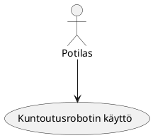

 Use Case - 3: Kuntoutusrobotin käyttö

**Info**

* Laatija: M3268
* Versio 1.0.0.1
* Kävelykuntoutusterapeutti käyttötapaus.
	
**Käyttäjäroolit**	

1. Potilas
2. Asiakas
3. Tuotteen/palvelun käyttäjä.

**Esitiedot/ehdot**	

1. Kuntoutusrobotti auttaa parantumisessa.
2. Palvelu on turvallinen.

**Käyttötapauksen kuvaus**

1. Tulee kävelykuntousrobotille.
2. Laitetaan valjaat päälle.
3. Käyttää osana harjoittelua.
4. Otaa valjaat pois.
5. Lopettaa käytön.

**Poikkeukset**
 
* P1 - Lopettaa tuotteen käytön jos se ei vastaa vaatimuksia.	

* P2 - Lopettaa palvelun käytön jos palvelu tai palvelija ei vastaa vaatimuksia.
	
**Lopputulos**	

* Potilas saa tarvitsemaansa kävelykuntoutusterapiaa.

**Käyttötiheys** 

* Käyttötapaus vastaa potilaan käyttöä.

**Muuta**	

* Kuvataan muita käyttötapaukseen liittyviä oleellisia tietoja, kuten avoimia asioita, viittauksia käytettäviin koodistoihin jne.

**Lähteet**

Tämä wiki-dokumentin runko pohjautuu [Julkisenhallinnon suosituksiin](http://www.jhs-suositukset.fi/web/guest/jhs/recommendations/173)

Kiitokset alkuperäisen tekijöille!