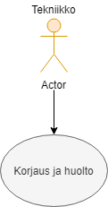

 Use Case - 4: Korjaus ja huolto

**Info**

* Laatija: M3268
* Versio 1.0.0.1
* Kävelykuntoutusterapeutti käyttötapaus.
	
**Käyttäjäroolit**	

1. Tekniikko
2. Huoltaja.
3. Palvelun ylääpitäjä.

**Esitiedot/ehdot**	

1. Kävelykuntoutusrobotti hyväksytään läpi ja julkaistaan tuote.
2. Tuotetta käytetään kävelykuntoutusterapiassa.
3. Tuote kuluu.
4. Tuotetta huolletaan tarpeen mukaan.

**Käyttötapauksen kuvaus**

1. Tuote kuluu käytössä.
2. Vika selvitetään.
3. Hankitaan tarvittavat resurssit.
4. Korjaa tuotteen.

**Poikkeukset**
 
* P1 - Ei korjaa ja huolla jos ei saa resursseja.	

* P2 - Ei korjaa ja huolla jos laite on liian rikki ja riskialtis. Tarvitaan uusi tilalle.
	
**Lopputulos**	

* Laite pysyy kunnossa.

**Käyttötiheys** 

* Käyttötapaus kuvaa laitteen huoltoa ja korjausta.

**Muuta**	

* Kuvataan muita käyttötapaukseen liittyviä oleellisia tietoja, kuten avoimia asioita, viittauksia käytettäviin koodistoihin jne.

**Lähteet**

Tämä wiki-dokumentin runko pohjautuu [Julkisenhallinnon suosituksiin](http://www.jhs-suositukset.fi/web/guest/jhs/recommendations/173)

Kiitokset alkuperäisen tekijöille!