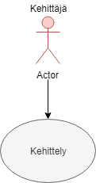

Use Case - 1: Kirjautuminen

**Info**

* Laatija: M3268
* Versio 1.0.0.1
* Kävelykuntoutusterapeutti käyttötapaus.
	
**Käyttäjäroolit**	

1. Kehittäjä
2. Insinööri.
3. Projektivastaava.

**Esitiedot/ehdot**	

1. Kävelykuntoutusrobotti hyväksytään läpi ja julkaistaan tuote.
2. Kehitellään tuotetta asiakastarpeita vastaavaksi.

**Käyttötapauksen kuvaus**

1. Selvittää vaatimusmäärittelyt.
2. Dokumentoi kaikki tarpeelliset tiedot.
3. Aloittaa kehittelyn.
4. Esittää toteutuksen prototyypin.
5. Toteuttaa tuoteen.
6. Valmistuu jatkotoimenpiteisiin.

**Poikkeukset**
 
* P1 - Lopettaa tuotteen kehittämisen jos saa potkut.	

* P2 - Lopettaa tuotteen ylläpidön jos joku toinen jatkaa kehittelyä.
	
**Lopputulos**	

* Onnistuneesti saatetaan projekti loppuun.

**Käyttötiheys** 

* Käyttötapaus vastaa kehittämisprosessia.

**Muuta**	

* Kuvataan muita käyttötapaukseen liittyviä oleellisia tietoja, kuten avoimia asioita, viittauksia käytettäviin koodistoihin jne.

**Lähteet**

Tämä wiki-dokumentin runko pohjautuu [Julkisenhallinnon suosituksiin](http://www.jhs-suositukset.fi/web/guest/jhs/recommendations/173)

Kiitokset alkuperäisen tekijöille!