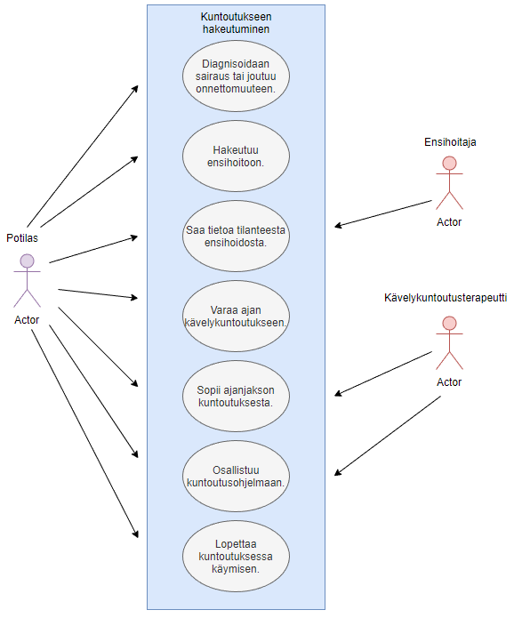

# Use Case - 1: Potilas hakee kuntoutuspalvelua

**Info**

* Laatija: M3268
* Versio 1.0.0.1
* Potilas käyttötapaus.
	
**Käyttäjäroolit**	

1. Asiakas.
2. Potilas.
3. Tuotteen/palvelun käyttäjä.

**Esitiedot/ehdot**	

1. Tieto tuotteesta tulee olla saatavilla
2. Tuote ja palvelu tulee olla saatavissa.
3. Palvelun tulee vastata potilaan tarpeita.

**Käyttötapauksen kuvaus**

1. Diagnisoidaan sairaus tai joutuu onnettomuuteen (lähtökohta ja ongelma asetelma).
2. Hakee tietoa palveluista ja tuotteista ongelmaan pohjautuen.
3. Rajaa haun löydöistä muutamiin vaihtoehtoihin.
4. Tekee valinnan käytettävästä tuotteesta ja/tai palvelusta.
5. Hakee tuotteen ja/tai hakeutuu palveluun.
6. Osallistuu tuotteen ja/tai palvelun käyttämiseen.

**Poikkeukset**
 
* P1 - Lopettaa tuotteen käytön jos se ei vastaa vaatimuksia.	

* P2 - Lopettaa palvelun käytön jos palvelu tai palvelija ei vastaa vaatimuksia.
	
**Lopputulos**	

* Potilas saa asiakastarpeita vastaavan palvelun, eli saa tarpeitaan vastaavan kävelykuntoutusterapian.

**Käyttötiheys** 

* Käyttötapaus vastaa ympäripyöreästi potilaan, eli käyttäjäkunnan käyttötapausta. Kävelykuntoutusrobotti-palvelussa sairaalassa tämä on yleisin käyttötapaus.

**Muuta**	

* Kuvataan muita käyttötapaukseen liittyviä oleellisia tietoja, kuten avoimia asioita, viittauksia käytettäviin koodistoihin jne.

**Lähteet**

Tämä wiki-dokumentin runko pohjautuu [Julkisenhallinnon suosituksiin](http://www.jhs-suositukset.fi/web/guest/jhs/recommendations/173)

Kiitokset alkuperäisen tekijöille!