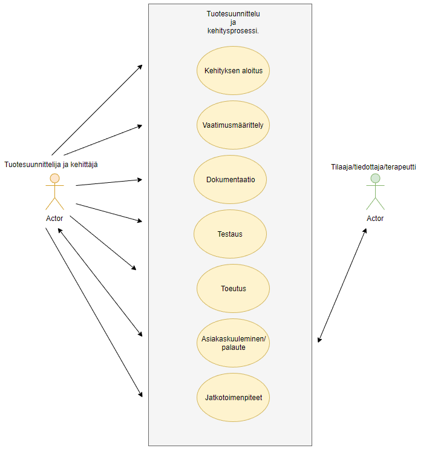

# Use Case - 3

**Info**

* Laatija: M3268
* Versio 1.0.0.1
* Potilas käyttötapaus.
	
**Käyttäjäroolit**	

1. Tuotesuunnittelija.
2. Tuotekehittejä.
3. Projektin jäsen.

**Esitiedot/ehdot**	

1. Tuotteen tulee vastata asiakkaan asettamia vaatimuksia ja ennakko-odotteita.
2. Tuote ja palvelu tulee olla saatavissa.
3. Tuotteen huolto jatkuu julkaisun jälkeen.

**Käyttötapauksen kuvaus**

1. Aloitetaan kehitys.
2. Määritellään vaatimukset.
3. Dokumentoidaan tiedot.
4. Testataan tuotetta.
5. Toteutetaan hyväksi todettu versio ja julkaistaan.
6. Kuullaan asiakaskuntaa ja otetaan palautetta vastaan.
7. Jatkotoimenpiteet.

**Poikkeukset**
 
* P1 - Lopettaa jos toinen tulee jatkamaan työtä.	

* P2 - Lopettaa jos palvelussa ei ole enää mitään kehitettävää vastuun osalta.
	
**Lopputulos**	

* Tilaaja saa asiakastarpeita vastaavan palvelun, eli saa tilaamansa tuotteen.

**Käyttötiheys** 

* Käyttötapaus vastaa ympäripyöreästi kehittämiseen, eli tapahtuu kerran pitkän aikavälin aikana (jatkuva prosessi).

**Muuta**	

* Kuvataan muita käyttötapaukseen liittyviä oleellisia tietoja, kuten avoimia asioita, viittauksia käytettäviin koodistoihin jne.

**Lähteet**

Tämä wiki-dokumentin runko pohjautuu [Julkisenhallinnon suosituksiin](http://www.jhs-suositukset.fi/web/guest/jhs/recommendations/173)

Kiitokset alkuperäisen tekijöille!