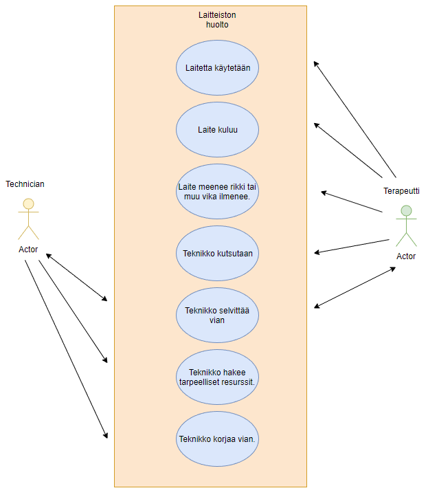

# Use Case - 4: Laitteen fyysinen huolto ja korjaus

**Info**

* Laatija: M3268
* Versio 1.0.0.1
* Potilas käyttötapaus.
	
**Käyttäjäroolit**	

1. Tekniikko.
2. Huolto.
3. Korjaus.

**Esitiedot/ehdot**	

1. Tuotteen tulee pysyä palvelukelpoisena.
2. Tuotteen tulee olla toiminnassa.
3. Tuote ei saa aiheuttaa fyysisiä turvauhkia.

**Käyttötapauksen kuvaus**

1. Terapeutti käyttää tuotetta.
2. Tuote kuluu kulutuksessa.
3. Laite meene rikki tai tulee muu vika.
4. Tekniikko kutsutaan.
5. Vianselvitys.
6. Tarpeellisten resurssien haku.
7. Huolto ja korjaus.

**Poikkeukset**
 
* P1 - Ei korjata mikäli vika on niin perusteellinen, että sitä ei voi korjata ja tarvitaan uusia koko laite.	

* P2 - Ei korjata mikäli tarpeellisia resursseja ei saada.	

* P3 - Ei korjaa jos ongelma on muualla kuin fyysiessä laitteessa.
	
**Lopputulos**	

* Laite toimii kuten pitääkin.

**Käyttötiheys** 

* Käyttötapaus vastaa ympäripyöreästi laitteen huoltoon ja korjaamiseen. Huolto tapahtuu säännöllisin ajoin ja korjaus tarvittaessa.

**Muuta**	

* Kuvataan muita käyttötapaukseen liittyviä oleellisia tietoja, kuten avoimia asioita, viittauksia käytettäviin koodistoihin jne.

**Lähteet**

Tämä wiki-dokumentin runko pohjautuu [Julkisenhallinnon suosituksiin](http://www.jhs-suositukset.fi/web/guest/jhs/recommendations/173)

Kiitokset alkuperäisen tekijöille!