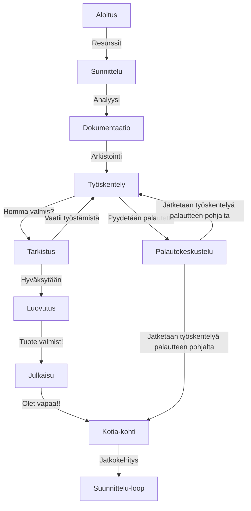

Ohjelmiston/palvelun vaatimusmäärittely

# TTOS0100 Kurssin harjoitustyö HT1 - TA-2019-3 

* M3268
* 2019
* V.1.0.0.1

## Sisällysluettelo 

**Pidä sisällysluettelo kunnossa, eli päivitä sitä tarpeen mukaan! Huomaa MarkDown-ankkurilinkitys**

* [Tuotteen kuvaus](#johdatus)
* [Palvelukuvaus](#palvelunkuvaus)
* [Asiakastarina](#asiakastarinat)
* [Sidosryhmät ja profiilikuvaukset](https://gitlab.labranet.jamk.fi/m3268---vuosi-2019/ttos0100---2019-toteutus/tree/master/dokumentit/02-vaatimusmaarittely/Profiilit%20ja%20sidosryhm%C3%A4t)
* [Sidosryhmäkuva - 1](dokumentit/02-vaatimusmaarittely/kuvat/CustomerMapV1.PNG)
* [Sidosryhmäkuva - 2](dokumentit/02-vaatimusmaarittely/kuvat/StakeHolderMapV1.JPG)
* [Palvelu/asiakaspolku](https://gitlab.labranet.jamk.fi/m3268---vuosi-2019/ttos0100---2019-toteutus/tree/master/dokumentit/02-vaatimusmaarittely/Asiakaspolut)
* [Yleinen käyttötapaus](https://gitlab.labranet.jamk.fi/m3268---vuosi-2019/ttos0100---2019-toteutus/tree/master/dokumentit/02-vaatimusmaarittely/Usecases)
* [Yleiset toiminnalliset vaatimukset](#toiminnallinen)
* [Yleiset ei-toiminnalliset vaatimukset](#ei-toiminnallinen)
* [Palvelu MockUp](https://student.labranet.jamk.fi/~M3268/Ohjelmistosuunnittelu/Projektity%C3%B6/MockUpOS.PNG)
* [Tärkeimmät ominaisuudet](https://gitlab.labranet.jamk.fi/m3268---vuosi-2019/ttos0100---2019-toteutus/tree/master/dokumentit/02-vaatimusmaarittely/Ominaisuudet)
* [Julkaisun suunnitelma](#julkaisu)
* [Palvelun/ohjelmiston arkkitehtuuri](#arkkitehtuuri)
* [Testaus ja laadunvarmistus](https://gitlab.labranet.jamk.fi/m3268---vuosi-2019/ttos0100---2019-toteutus/tree/master/dokumentit/02-vaatimusmaarittely/Hyv%C3%A4ksynt%C3%A4testit)
* [Lähteet](#lähteet)

# Johdatus

Tilauksen on tehnyt Orcs of the Middle-Earth. Projektissa lähdettiin kehittämään kävelykuntoutusrobottia. Tavoitteena on luoda toimiva, eri tilanteita huomioiva, ergonominen ja ekonominen ratkaisu asiakastarpeisiin.

Kävelykuntoutusterapiassa on useanlaisia potilaita, eri tilanteissa, vaatimustarpeissa ja käyttötarkoituksen tarpeessa. Siksi on tärkeää pyrkiä tuottamaan tuote, joka soveltuu moneen eri käyttötarpeeseen.
Käytännössä se tarkoittaa sitä, että kävelykuntoutusrobotin tulee olla säädettävissä ja pystyä huomiomaan käytön vaatimukset. Lisäksi sen täytyy pystyä keräämään dataa ja kääntää se kuntouttajille hyödylliseksi dokumentiksi.

## Palvelunkuvaus

Projektissa kehitellään kävelykuntoutusrobottia Fauxton sairaalan tilaamana. Tavoitteena on tuottaa sellainen tuote, joka vastaa asiakkaan odotuksia ja vaatimuksia, sekä osaa huomioida myös sanattomia asiakastarpeita.

Tälläisiä asiakastarpeita ovat mm. logistiset ominaisuudet kuten kävelykuntoutusrobotin ergonomisuus ja siirrettävyys, kävelykuntoutusrobotin huolto ja kävelykuntoutusrobotin turvallisuuteen, luotettavuuteen ja toiminnallisuuteen viittaavat tekijät.
Lisäksi on huomioitava tuotetta käyttävän asiakaskunnan yksilötarpeet, kuten värisokeus, sokeus, kuurous, erikielisyys, liikuntarajoitteisuus ja muut vastaavat piirteet.

Palvelun avulla voidaan avustaa tilaajan asiakaskuntaa kävelykuntoutuksen terapiassa ja auttaa työntekijöitä ymmärtämään asiakkaiden yksilöllisistä asiakastarpeista.
Asiakaskunnan kannalta kävelykuntoutusrobootin tehtävä olisi auttaa heitä kuntoutumaan kävelykuntoutusterapiassa ja vastata heidän odotuksia ja tarpeita kussakin tilanteessa.
Tilaajan kannalta on huomioitava projektin vaatimuusmäärittelyt, arkkitehtuuri, toteutettavuus käytännöllisesti ja taloudellisesti.

## Vaatimusmäärittelytyön tilaaja

Fauxston hospital.

##### Fauxston hospital:

* Yrityksen johtaja-kunta.
* Kävelykuntoutusterapian osastovastaava.
* Kavelykuntoutusterapeutti.
* Kävelykuntoutusterapiasta vastaava lääkäri.
* Kuntaryhmän projektivastaavat.
* Kuntatalous vastaavat.
* Sijoittajat.

##### Kuntoutusterapian potilas:

* Raajarikosta kärsivä potilas tarvitsee robotin lievää tukea.
* Halvauksesta kärsivä potilas tarvitsee laajamittaista tukea robotilta ja sen ohjelmistolta.
* Motorisesta sairaudesta sairastava potilas, joka tarvitsee robotilta tukea kognitiivisten ja motoristen toimintojen kehittämiseen ja hallintaan.
* Jalkaproteesin saanut henkilö tarvitsee apua tottuakseen uuteen proteesiin.
* Olen hiljattain sokeutunut ja tarvitsen kävelyterapiaa kävelyn harjoitteluun ja sijaintini tunnistamiseen.
* Olen kuuro ja käyn kävelyterapiassa muutamankerran sopeutuakseni ympäristööni,
* I am a foreigner and I do not speak good English or Finnish but I can speak fluent German. It makes communicating in walking therapy hard.
* Olen värisokea ja minua harmittaa kuinka usein kohtaan ongelmaani kävelyterapiassakin.

## Vaatimusmäärittelyn toimittaja

Olen projektiryhmän suunnittelija ja konsultti Robot and Artificial Intelligence Development Organization yrityksessä.

## Valitut asiakastarinat

A: Olen 34-vuotias proteesin saanut mies, ja käyn kävelykuntoutusterapiassa harjoittelemassa proteesin käyttöä. 

B: Olen hipiästä alaspäin halvaantunut 46-vuotias nainen, ja käyn kävelykuntoutusterapiassa opettelemassa uudelleen kävelemään.

C: Pienestä asti olen sairastanut harvinaista motoorista sairausta ja käyn kävelykuntoutusterapaissa viikoittain.

E: Jouduin onnettomuuteen ja käyn kuntoutusterapaissa osana parantumistani.

D: I moved into Finland few years ago and I got into accident. I go to walking therapy and use a robot  to help and guide me back into fit shape.

F: Olen hiljattain sokeutunut kävelykuntoutusterapian asiakas. Käyn siellä harjoittelemassa uuta elämäntilannettani.

G: Olen kuuro ja liikuntarajoitteinen. Käyn kävelykuntoutusterapiassa harjoittelemassa liikkumista parantuakseni.

H: Olen kävelykuntoutusterapeutti ja tehtäväni on vastata potilaiden kävelykuntoutuksesta.

I: Olen kävelykuntoutusrobotin tilaaja, ja tavoitteena olisi saada toimiva kävelykuntoutus-robotti palvelu kävelykuntoutusterpian asiakaskunnalle.

J: Olen sijoittaja, ja haluan selvittää onko tuote talouskelpoinen.

## Yleinen sidosryhmäkuva (Stakeholder map)

1. Sidosryhmäkartta kuvaa yksittäisten potilaiden (oranssi) mahdollisia asiakastarpeita ja motiiveja kävelykuntoutusrobootin käyttötarpeeseen liittyen. Sinisellä merkatut kuvaavat projektin hallinto ja talouspuolen sidosryhmän jäseniä. Tässä tapauksessa projektin tilaajaa ja sijoittajia. Vihreät kuvaavat potilaita hoitavia kävelykuntoutusterapeutteja, joista toinen havainnollistaa mitä ongelmia myös heidänkin käyttö voi aiheuttaa. Punainen kuvaa ilkitekijää, tässä tapauksessa tietoturvauhkana toimivaa hakkeria, joka haluaa hyväksikäyttää kävelykuntoutusrobotissä käytettyä ohjelmaa henkilötiedon varastamiseen.

2. Sidosryhmäkarttalla lilaisella kuvattavat potilaat kuvaa erillaisia esimerkki potilas ja erityistarveryhmiä ja heidän uniikkeja asiakastarpeita. Metallin sininen kuvaa sairaalaa ja millainen motiivi organisaatiolla/instituutilla on tuottaa kävelykuntoutusrobotin palveluita. Vihreä kuvaa investoijia. Turkoosi kuvaa kuntaa ja miksi kuntaa kiinnostaa tälläisten palveluiden tukeminen. Sininen kuvaa projektin tilaajaa ja hallintoa kuten edellisessäkin. Nyt oranssilla merkattu kuvaa lakiasiantuntijoita ja muita edunvalvojia ja laadunvalvojatahoja. Punainen tässä kuviossa kuvaa palvelinkehittäjiä ja projektijäseniä. Lopuksi keltainen kuvaa suomen sosiaalitoimistoja ja KELA palveluita, ja millainen suhde niillä tahoilla on palveluun. 

## Tunnistetut sidosryhmäkuvaukset (Stakeholders) 

* [Profiili - 1: Potilas](http://m3268---vuosi-2019.pages.labranet.jamk.fi/ttos0100---2019-toteutus/02-vaatimusmaarittely/Profiilit%20ja%20sidosryhm%C3%A4t/Profiili-1/)
* [Profiili - 2: Tilaaja](http://m3268---vuosi-2019.pages.labranet.jamk.fi/ttos0100---2019-toteutus/02-vaatimusmaarittely/Profiilit%20ja%20sidosryhm%C3%A4t/Profiili-2/)
* [Profiili - 3: Kävelykuntoutusterapeutti](http://m3268---vuosi-2019.pages.labranet.jamk.fi/ttos0100---2019-toteutus/02-vaatimusmaarittely/Profiilit%20ja%20sidosryhm%C3%A4t/Profiili-3/)
* [Profiili - 4: Investoija](http://m3268---vuosi-2019.pages.labranet.jamk.fi/ttos0100---2019-toteutus/02-vaatimusmaarittely/Profiilit%20ja%20sidosryhm%C3%A4t/Profiili-4/)
* [Profiili - 5: Lakiasiantuntija](http://m3268---vuosi-2019.pages.labranet.jamk.fi/ttos0100---2019-toteutus/02-vaatimusmaarittely/Profiilit%20ja%20sidosryhm%C3%A4t/Profiili-5/)
* [Profiili - 6: Hakkeri](http://m3268---vuosi-2019.pages.labranet.jamk.fi/ttos0100---2019-toteutus/02-vaatimusmaarittely/Profiilit%20ja%20sidosryhm%C3%A4t/Profiili-6/)
* [Profiili - 7: Kehittäjä](https://gitlab.labranet.jamk.fi/m3268---vuosi-2019/ttos0100---2019-toteutus/blob/master/dokumentit/02-vaatimusmaarittely/Profiilit%20ja%20sidosryhm%C3%A4t/Profiili-7.md)
* [Profiili - 8: Tekniikko](https://gitlab.labranet.jamk.fi/m3268---vuosi-2019/ttos0100---2019-toteutus/blob/master/dokumentit/02-vaatimusmaarittely/Profiilit%20ja%20sidosryhm%C3%A4t/Profiili-8.md)

## Palvelu/asiakaspolku (Customer Journey/Path)

1. Asiakaspolku: Asiakaspolussa potilas saa diagnoosin sairaudesta. Hänestä lähetetään lähete paikalliseen sairaalaan. Tämän jälkeen potilas soittaa sairaalan ja kuulee jatkotoimenpiteistä. Yhteydenoton aikana hän sopii lääkärin kanssa ajan. Tämän jälkeen potilas tulee kävelykuntoutusterapiaan ja kuulee, että kävelykuntoutusterapiaan on tullut uusi kävelykuntoutusrobotin tukema kuntoutusmuoto  Lääkärin kanssa he sopivat, että potilas ossallistuu kävelykuntoutusterapiaan kävelykuntoutusrobottia hyödyntäen. Potilaasta kysytään perustietoja jos lähetteessä ei jo ole ja tiedot syötetään käyttöjärjestelmään. Käyttöjärjestelmä tallentaa tiedot tietokantaan. Kun potilas alkaa käyttämään kävelykuntoutusrobottia, se tallentaa potilaasta dataa, tallentaa tiedot tietokantaan ja kysyttäessä suorittaa kyselun ja esittää tiedot käyttöjärjestelmässä.

2. Asiakaspolku: Asiakaspolku kuvaa kävelykuntoutusterapeutin asiakaspolkua. Työpaikalle kehitellään uusi kävelykuntoutusrobotti ja sitä aletaan käyttämään osana kävelykuntoutusterapiaa. Tämän uuden työkalun avulla kävelykuntousterapeutti voi auttaa klinikalla käyviä potilaita paremmin paranemisprosessissa. Kehitysvaiheessa kuntoutusterapeutti antaa palautetta mitä olisi hyvä olla laitteessa ja millaisia tarpeita potilailla voi olla. Käytössä hän arvioi miten hyvin laite vastaa asiakastarpeita. Lopulta hän lähettää palautetta jatkokehittelylle.

[Profiili - 1: Potilas](http://m3268---vuosi-2019.pages.labranet.jamk.fi/ttos0100---2019-toteutus/02-vaatimusmaarittely/Profiilit%20ja%20sidosryhm%C3%A4t/Profiili-1/) on ongelma. Hänellä diagnisoidaan sairaus tai hän joutuu onnettomuuteen.
Ensiapuun hakeuduttuaan ensihoitaja kertoo, että hän tulee tarvitsemaan kävelykuntoutusterapiaa ja ensihoitaja antaa potilaalle tarvittavat tiedot missä sellaista kävelykuntoutusterapiaa järjestetään.

[Profiili - 1: Potilas](http://m3268---vuosi-2019.pages.labranet.jamk.fi/ttos0100---2019-toteutus/02-vaatimusmaarittely/Profiilit%20ja%20sidosryhm%C3%A4t/Profiili-1/) varaa ajan kävelykuntoutusterapiaan ja
kävelykuntoutusterapiasta vastaa [Profiili - 3: Kävelykuntoutusterapeutti](http://m3268---vuosi-2019.pages.labranet.jamk.fi/ttos0100---2019-toteutus/02-vaatimusmaarittely/Profiilit%20ja%20sidosryhm%C3%A4t/Profiili-3/).
Kävelykuntoutusterapeutin ohjeistuksen ja avustuksen avulle he työskentelevät yhdessä [Profiili - 1: Potilas](http://m3268---vuosi-2019.pages.labranet.jamk.fi/ttos0100---2019-toteutus/02-vaatimusmaarittely/Profiilit%20ja%20sidosryhm%C3%A4t/Profiili-1/) paranemisprosessin eteen.
Kuntoutuksen aikana [Profiili - 3: Kävelykuntoutusterapeutti](http://m3268---vuosi-2019.pages.labranet.jamk.fi/ttos0100---2019-toteutus/02-vaatimusmaarittely/Profiilit%20ja%20sidosryhm%C3%A4t/Profiili-3/)
kuuntelee [Profiili - 1: Potilas](http://m3268---vuosi-2019.pages.labranet.jamk.fi/ttos0100---2019-toteutus/02-vaatimusmaarittely/Profiilit%20ja%20sidosryhm%C3%A4t/Profiili-1/) asikaskokemuksia.
Kun kävelykuntoutusterapia loppuu [Profiili - 1: Potilas](http://m3268---vuosi-2019.pages.labranet.jamk.fi/ttos0100---2019-toteutus/02-vaatimusmaarittely/Profiilit%20ja%20sidosryhm%C3%A4t/Profiili-1/) kohdalta, lähettää [Profiili - 3: Kävelykuntoutusterapeutti](http://m3268---vuosi-2019.pages.labranet.jamk.fi/ttos0100---2019-toteutus/02-vaatimusmaarittely/Profiilit%20ja%20sidosryhm%C3%A4t/Profiili-3/) vielä palautetta palveluista ja tuotteista vastaaville tahoille.

Viimeinen kuvio kuvaa sekvenssiokaaviota tapahtumakohtaisesti systeemikokonaisuutena. Tässä mallissa on huomioitu myös tietokannat.

# Vaatimukset, käyttötapaukset ja ominaisuudet

## Tuotteen järjestelmävaatimukset ja mahdolliset rajoitukset (Key Requirements and restrictions)

Kävelykuntoutusrobotin tulee soveltua käyttöön. Sen pitää pystyä tukemaan asiakkaita, keräämään dataa ja esittämään sitä visuaalisesti.
Sen tulee olla kestävä, helppohuoltoinen ja luotettava. Tuotteen tulee pystyä olemaan helppokäyttöinen ja ketterä soveltuakseen erillaisiin kävelykuntoutusterapian haasteisiin ja asiakaskunnan tarpeisiin.
Sen pitää pystyä myös olemaan helposti ymmärrettävissä ja säädettävissä, jos esimerkiksi asiakas onkin eri kokoinen, värisokea tai vaikka ulkomaalainen.
Laitteen kohdat tulee olla helposti tunnistettavissa sokeillekkin asiakkaille, ja potilaalle näytettävän visuaalisen representaation tulee olla selkeää niin, että kuurokin ymmärtää mistä on kyse.

| VaatimusID | Tyyppi | Kuvaus | Ominaisuus johon vaikuttaa |								
|:-:|:-:|:-:|:-:|
| SYSTEM-REQ-0001 | System Requirement | Laitteen tulee soveltua neurologisesti vaikeavammaiselle, erityisesti kävelykuntoutuksen akuuttivaiheeseen. | [Asiakasturvallisuus](dokumentit/02-vaatimusmaarittely/Ominaisuudet/Ominaisuus - 7.md) |
| SYSTEM-REQ-0002 | System Requirement | Laitteen tulee olla robottiavusteinen, varustettuna mekaanisesti säädettävillä ortooseilla. | [Asiakasturvallisuus](dokumentit/02-vaatimusmaarittely/Ominaisuudet/Ominaisuus - 7.md) |
| SYSTEM-REQ-0003 | System Requirement | Kävelyrobotin tulee sisältää muun muassa ortoosit, juoksumaton ja painonkevennysjärjestelmän. | [Asiakasturvallisuus](dokumentit/02-vaatimusmaarittely/Ominaisuudet/Ominaisuus - 7.md) |
| SYSTEM-REQ-0004 | System Requirement | Tarjottavien laitteiden on täytettävä lain terveydenhuollon laitteista ja tarvikkeista ja siihen tehtyjen muutosten sekä viranomaisten asettamat vaatimukset sairaanhoitotarvikkeille ja laitteille.| [Asiakasturvallisuus](dokumentit/02-vaatimusmaarittely/Ominaisuudet/Ominaisuus - 7.md) |
| SYSTEM-REQ-0005 | System Requirement | Tarjottujen tuotteiden tulee täyttää Suomessa voimassaolevat työ- ja käyttöturvallisuusvaatimukset. | [Asiakasturvallisuus](dokumentit/02-vaatimusmaarittely/Ominaisuudet/Ominaisuus - 7.md) |
| SYSTEM-REQ-0006 | System Requirement | Tarjottujen tuotteiden tulee olla CE-merkittyjä. | [Tekninen huolto](dokumentit/02-vaatimusmaarittely/Ominaisuudet/Ominaisuus - 4.md) |
| SYSTEM-REQ-0007 | System Requirement | Laitteessa on oltava dynaaminen painonkevennysjärjestelmä, jota on voitava käyttää kaukosäätimellä. | [Ohjelmisto](dokumentit/02-vaatimusmaarittely/Ominaisuudet/Ominaisuus - 3.md) |
| SYSTEM-REQ-0008 | System Requirement | Laitteen mukana tulee toimittaa 4 kappaletta valjaita erikokoisille kuntoutujille, kokojen tulee olla S, M, L ja XL tai vastaavat.| [Asiakasturvallisuus](dokumentit/02-vaatimusmaarittely/Ominaisuudet/Ominaisuus - 7.md) |
| SYSTEM-REQ-0019 | System Requirement | Laitteen juoksumatolle on päästävä helposti pyörätuolilla ramppia pitkin. | [Käyttötuki](dokumentit/02-vaatimusmaarittely/Ominaisuudet/Ominaisuus - 1.md) |
| SYSTEM-REQ-0010 | System Requirement | Laitteen tulee soveltua 130 kg painoiselle henkilölle ja mahdollistaa 200 cm pituisen potilaan painokevennetyn kävelyn. | [Asiakasturvallisuus](dokumentit/02-vaatimusmaarittely/Ominaisuudet/Ominaisuus - 7.md) |
| SYSTEM-REQ-0011 | System Requirement | Laitteen täytyy soveltua painokevennettyyn kävelymattokuntoutukseen robottiavusteisesti, mutta myös ilman robottia painekevennetyn kävelyn harjoitteluun. | [Asiakasturvallisuus](dokumentit/02-vaatimusmaarittely/Ominaisuudet/Ominaisuus - 7.md) |
| SYSTEM-REQ-0012 | System Requirement | Laitteessa täytyy olla virtuaalinen biofeedback-ohjelmisto sekä näyttötaulu tai muu vastaava tekninen ratkaisu. | [Ohjelmisto](dokumentit/02-vaatimusmaarittely/Ominaisuudet/Ominaisuus - 3.md) |
| SYSTEM-REQ-0013 | System Requirement | Ohjelmistojen tulee soveltua toimintakyvyltään eritasoisille kuntoutujille. | [Ohjelmisto](dokumentit/02-vaatimusmaarittely/Ominaisuudet/Ominaisuus - 3.md) |
| SYSTEM-REQ-0014 | System Requirement | Laitteella tulee pystyä mittaamaan vähintään seuraavat: kävelymatka, lihasten aktiivisuus, lihasten jäykkyys/vastus, alaraajanivelten liikelaajuudet ja isometriset liikevoimat. | [Datan keruu](dokumentit/02-vaatimusmaarittely/Ominaisuudet/Ominaisuus - 2.md) |
| SYSTEM-REQ-0015 | System Requirement | Laitteessa tulee olla mahdollisuus tallentaa vähintään 10 kuntoutujan mittaustulokset ja harjoitushistoria myöhempää dokumentointia varten (tallenteet tulee saada myös tulostettua). | [Ohjelmisto](dokumentit/02-vaatimusmaarittely/Ominaisuudet/Ominaisuus - 3.md) ||
| SYSTEM-REQ-0016 | System Requirement | Laitteella tai lisälaitteella on pystyttävä ohjaamaan mekaanisesti lantion sivusuuntaista liikettä painonsiirron simuloimiseksi sekä lantion kiertoa.| [Ohjelmisto](dokumentit/02-vaatimusmaarittely/Ominaisuudet/Ominaisuus - 2.md) |
| SYSTEM-REQ-0017 | System Requirement | Laitteessa on oltava tietokoneyhteydellä ja voimasensoreilla varustetut alaraajaortoosit. | [Datan keruu](dokumentit/02-vaatimusmaarittely/Ominaisuudet/Ominaisuus - 2.md) |

# Oleelliset huomioitavat rajoitteet

| Id | Vaatimuksen kuvaus | kategoria | Vastuullinen |
|:-:|:-:|:-:|:-:|
| CONSTRAINT-REQ-S00000 | Constrain | Tuote on ergonominen.  | Kävelykuntoutusterapeutti/Kehittäjä |
| CONSTRAINT-REQ-S00001 | Constrain | Tuote on skaalautuva. | Projektivastaava/Kehittäjä |
| CONSTRAINT-REQ-S00002 | Constrain | Tuotteen on helppokäyttöinen. | Kävelykuntoutusterapeutti/Projektivastaava/Tekniikko/Kehittäjä  |
| CONSTRAINT-REQ-S00003 | Constrain | Tuote on asiakasturvallinen. | Tekniikko/Kehittäjä |
| CONSTRAINT-REQ-S00004 | Constrain | Tuote on tietoturvallinen. | Kehittäjä |
| CONSTRAINT-REQ-S00005 | Constrain | Tuote on siirrettävissä. | Tekniikko |
| CONSTRAINT-REQ-S00006 | Constrain | Tuote on ketterä. | Kävelykuntoutusterapeutti/Kehittäjä |

## Tärkeimmät käyttötapaukset (General Use Cases)

Tärkeimmissä tapauksissa on kuntoutusrobotin käyttöä aktiivisimmin käyttävät tahot. Nämä tahot ovat potilas [Profiili - 1](http://m3268---vuosi-2019.pages.labranet.jamk.fi/ttos0100---2019-toteutus/02-vaatimusmaarittely/Profiilit%20ja%20sidosryhm%C3%A4t/Profiili-1/) ja kävelykuntouitusterapeutti [Profiili - 2](http://m3268---vuosi-2019.pages.labranet.jamk.fi/ttos0100---2019-toteutus/02-vaatimusmaarittely/Profiilit%20ja%20sidosryhm%C3%A4t/Profiili-2/).
Kävelykuntoutusterapeutti saa työpaikalleen kävelykuntoutusrobotin ja työryhmän kanssa he alkavat analysoimaan miten uusi työkalu voidaan parhaiten integroida osana kuntoutusohjelmaa.

Kun kuntoutusrobotti läpäisee tarvittavat testit, voi kävelykuntoutuksesta vastaava työryhmä alkaa käyttämään sitä osana kuntoutusohjelmaa.
Kävelykuntoutusterapiaan päästessä potilas aloittaa kävelyrobotin käyttämisen osana kuntoutusterapian ohjelmaa kävelykuntousterapeutin ohjeistuksen tukemana.

Käytön aikana potilas ja terapeutti ovat keskenään vuorovaikutuksessa ja toimivat yhdessä tavoitteena potilaan parantuminen. Samalla prosessista kerätään tarpeellista tietoa eri osa-aluista.
Kun kuntoutusohjelma loppuu, koostetaan kaikki tiedot omiin luokkiinsa ja jälleenvälitetään sitä eteenpäin palvelun laadun parantamiseksi ja tuotekehittelyä varten.

* [Käyttötapaus 1 - Potilas hakee kuntoutuspalvelua](https://gitlab.labranet.jamk.fi/m3268---vuosi-2019/ttos0100---2019-toteutus/blob/master/dokumentit/02-vaatimusmaarittely/Usecases/Usecase%20-%201.md)
* [Käyttötapaus 2 - Kävelykuntoutusterapeuttii hyödyntää kuntoutusrobottia osana terapiaa](https://gitlab.labranet.jamk.fi/m3268---vuosi-2019/ttos0100---2019-toteutus/blob/master/dokumentit/02-vaatimusmaarittely/Usecases/Usecase%20-%202.md)
* [Käyttötapaus 3 - Kehittämisprosessi ennen ja julkaisun jälkeen](https://gitlab.labranet.jamk.fi/m3268---vuosi-2019/ttos0100---2019-toteutus/blob/master/dokumentit/02-vaatimusmaarittely/Usecases/Usecase%20-%203.md)
* [Käyttötapaus 4 - Laitteen fyysinen huolto ja korjaus](https://gitlab.labranet.jamk.fi/m3268---vuosi-2019/ttos0100---2019-toteutus/blob/master/dokumentit/02-vaatimusmaarittely/Usecases/Usecase%20-%204.md)

## Palveluun liittyvät tärkeimmät toiminnalliset vaatimukset (Functional Requirements)

Toiminnallisia vaatimuksia liittyvät tuotteen toimintoihin käytännössä. Laitteen pitää pystyä olemaan turvallinen asiakkaalle ja käyttäjälle, eli se ei saa olla liian hutera tai liian kireä.
Se ei saa olla liina raskas ja/tai kömeplö. Laitteen tulee olla mukava ja luonnollinen käyttää ja sen pitää osata mukailla ihmisen jalan rakennetta tavalla, joka tukee sitä. Myös silloinkin kun kyseessä on jalka-proteesi.

Laitteen tulee myös olla sokealle helposti hahmoteltavissa ja tunnistettavissa, eli käyttäjälle relevantit kohdat kuten juoksumatto ja käsitukitangot tulee olla helposti käsillä, samalla kun tekniset osat tulee olla laitteiston sisällä.
Laitteen pitää pystyä olemaan tarpeaksi ketterä, se ei siis saa vaikeuttaa kuntoutumisprosessissa käyvän kävelyn kokemusta ja harjoittelua. 

| VaatimusID | Tyyppi | Kuvaus | Ominaisuus johon vaikuttaa |								
|:-:|:-:|:-:|:-:|
| FUNCTIONAL-REQ-C0001 | Functional Requirement | Potilas kokee käytön vaivattomaksi. | [Asiakasturvallisuus](dokumentit/02-vaatimusmaarittely/Ominaisuudet/Ominaisuus - 7.md)  |
| FUNCTIONAL-REQ-C0002 | Functional Requirement | Tuote ei vahingoita potilaita. | [Asiakasturvallisuus](dokumentit/02-vaatimusmaarittely/Ominaisuudet/Ominaisuus - 7.md) |
| FUNCTIONAL-REQ-C0003 | Functional Requirement | Tuote tukee potilaiden raajoja. | [Asiakasturvallisuus](dokumentit/02-vaatimusmaarittely/Ominaisuudet/Ominaisuus - 7.md) |
| FUNCTIONAL-REQ-C0004 | Functional Requirement | Laite on ketterä. | [Asiakasturvallisuus](dokumentit/02-vaatimusmaarittely/Ominaisuudet/Ominaisuus - 7.md) |
| FUNCTIONAL-REQ-C0005 | Functional Requirement | Laitetta voidaan säätää ja se skaalautuu. | [Asiakasturvallisuus](dokumentit/02-vaatimusmaarittely/Ominaisuudet/Ominaisuus - 7.md) |
| FUNCTIONAL-REQ-C0006 | Functional Requirement | Laite pystyy esittämään kuntoutusohjelman selkeästi monelle eri aistille. | [Datan keruu](dokumentit/02-vaatimusmaarittely/Ominaisuudet/Ominaisuus - 2.md) |
| FUNCTIONAL-REQ-C0007 | Functional Requirement | Potilas kokee olonsa turvalliseksi laitteen käytön aikana. | [Asiakasturvallisuus](dokumentit/02-vaatimusmaarittely/Ominaisuudet/Ominaisuus - 7.md) |
| FUNCTIONAL-REQ-C0008 | Functional Requirement | Kuntouttaja pystyy helposti ymmärtämään miten laite toimii. | [Ohjelmisto](dokumentit/02-vaatimusmaarittely/Ominaisuudet/Ominaisuus - 3.md) |
| FUNCTIONAL-REQ-C0009 | Functional Requirement | Laite ei ole liian kiristävä, raskas tai kömpelö aiheuttaakseen vaaratilanteita. | [Asiakasturvallisuus](dokumentit/02-vaatimusmaarittely/Ominaisuudet/Ominaisuus - 7.md) |
| FUNCTIONAL-REQ-C0010 | Functional Requirement | Käyttöä voidaan soveltaa tarvittaessa. | [Ohjelmisto](dokumentit/02-vaatimusmaarittely/Ominaisuudet/Ominaisuus - 3.md) |

## Palveluun liittyvät tärkeimmät ei-toiminnalliset vaatimukset (Non Functional Requirements)

Voit esittää eri vaatimuksia erillisessä taulukossa tai viitata tässä [yhteen](pohjat/pohja-vaatimuslistalle.md) laajempaan taulukkoon..

Tuotteen ehdottomia ei-toiminnallisia vaatimuksia on sen käyttöön ja huoltoon liittyvät piirteet. Laitteen on oltava ergonominen käyttää sekä potilaan, että terapeutin näkökulmasta.
Sen tulee olla intuitiivinen, eli tiedot tulee nähdä selkeästi ja vaivattomasti, ja sen esitys näytölle tulee olla loogista, selkeää, ja ulkoasun tarkoin mietittyä.

Laitteen tulee myös olla logistisesti realistinen, eli se ei saa olla liian hankala purkaa ja jälleenkasata, se ei saa olla liian vaikea huoltaa tai tarvittaessa korvata epäkelvot osat uusilla toimivilla osilla.
Laitten pitää olla sen verran kevyt, että se voidaan siirtää tarvittaessa jos tilanne sitä vaatii.
Se ei myöskään saa olla ekonomisesti, eli taloudellisesti liian resurssikallis. Osat tulee olla kohtuullisen hintaisia, jotta projektin materiaalinen toteutus on realistinen.

### Suorituskyky? (Performance)

Tuotteen tulee kestää käyttö ja olla käyttäjäystävällinen ja turvallinen laite.

| VaatimusID | Tyyppi | Kuvaus | Ominaisuus johon vaikuttaa |								
|:-:|:-:|:-:|:-:|
| PERFORMANCE-REQ-0000 | Non-Functional Performance | Logit käyttäjän sessiosta. | [Ohjelmisto](dokumentit/02-vaatimusmaarittely/Ominaisuudet/Ominaisuus - 2.md) |								
| PERFORMANCE-REQ-0001 | Non-Functional Performance | Käyttäjätunnukset vähintään 10 potilaasta. | [Ohjelmisto](dokumentit/02-vaatimusmaarittely/Ominaisuudet/Ominaisuus - 2.md) |
| PERFORMANCE-REQ-0002 | Non-Functional Performance | Käyttäjätietoa vähintään 10 potilaasta. | [Ohjelmisto](dokumentit/02-vaatimusmaarittely/Ominaisuudet/Ominaisuus - 2.md) |
| PERFORMANCE-REQ-0003 | Non-Functional Performance | Näyttöruudun presentaatio on selkeää. | [Kirjautuminen](dokumentit/02-vaatimusmaarittely/Ominaisuudet/Ominaisuus - 6.md) |

### Tietoturva?

Vaikka kävelykuntoutusrobotti ei ole primäärisesti esillä nykyisessä IoT-maailmassa, voi sen tietokantaan silti tulla tietoturvauhkia kuten erinäiset höykkäykset ja tiedonkaappauksen yritykset.
Tästä syystä on huomioitava ei-funktionaalisia turvallisuuteen liittyviä tekijöitä ja miten palvelun tietoturva voidaan turavata palvelun kokonaisuuden komponenttina.

| VaatimusID | Tyyppi | Kuvaus | Ominaisuus johon vaikuttaa |								
|:-:|:-:|:-:|:-:|
| SECURITY-REQ-0001 | Non-Functional Security | Henkilokohtainen tieto tulee turvata instituutin tietoturvastandardien mukaisesti. | [Tietoturva](dokumentit/02-vaatimusmaarittely/Ominaisuudet/Ominaisuus - 8.md) |								
| SECURITY-REQ-0002 | Non-Functional Security | Tiedon tulee epäsuorasti viitata henkilöihin potilastunnuksilla, ei henkilötiedoilla. | [Tietoturva](dokumentit/02-vaatimusmaarittely/Ominaisuudet/Ominaisuus - 8.md) |
| SECURITY-REQ-0003 | Non-Functional Security | Tieto tulee olla kirjoitettavissa, ylikirjoitettavissa ja poistettavissa milloin vain. | [Tietoturva](dokumentit/02-vaatimusmaarittely/Ominaisuudet/Ominaisuus - 8.md) |
| SECURITY-REQ-0004 | Non-Functional Security | Tiedosta tehdään automaattisesti varmuuskopio muualle kaiken varalta. | [[Tietoturva](dokumentit/02-vaatimusmaarittely/Ominaisuudet/Ominaisuus - 8.md) |
| SECURITY-REQ-0005 | Non-Functional Security | Laitteessa tulee olla sisäänkirjautumisvaatimus käyttöä varten. | [Kijrautuminen](https://gitlab.labranet.jamk.fi/m3268---vuosi-2019/ttos0100---2019-toteutus/blob/master/dokumentit/02-vaatimusmaarittely/Ominaisuudet/Ominaisuus%20-%206.md)|
| SECURITY-REQ-0006 | Non-Functional Security | Tieto tallentuu tietokantaan, mistä ohjelma hakee sitä kutsusta. | [Tietoturva](dokumentit/02-vaatimusmaarittely/Ominaisuudet/Ominaisuus - 8.md) |
| SECURITY-REQ-0007 | Non-Functional Security | Tuotteessa tulee olla teollisuustason virustentorjuntaohjelma ja tietoturvaa ylläpitävä ohjelma. | [Tietoturva](dokumentit/02-vaatimusmaarittely/Ominaisuudet/Ominaisuus - 8.md) |

### Käytettävyys

Käytettävyyteen liittyy käyttöliittymän ominaisuuksia. Käytettävyyttä parantaa selvä representaatio, käyttöliittymän looginen järjestys, hyväksi todetut mallit.
Toiminnot tulee löyttää helposti ja valinta-valikko olisi hyvä olla aina näkyvillä käyttöliittymän kätevyyden ja nopean käytettävyyden mahdollistamiseksi.

| VaatimusID | Tyyppi | Kuvaus | Ominaisuus johon vaikuttaa |								
|:-:|:-:|:-:|:-:|
| USABILITY-REQ-0000 | Non-Functional Usability | Käyttöliittymän on toimittava myös ääniohjattuna, koska käyttäjillä saattaa olla näkövammoja. | [Ohjelmisto](dokumentit/02-vaatimusmaarittely/Ominaisuudet/Ominaisuus - 2.md) |	
| USABILITY-REQ-0001 | Non-Functional Usability | Käyttöliittymän on selkeästi esitettävä tieto käyttäjille. Käyttäjä voi olla kuuro. | [Ohjelmisto](dokumentit/02-vaatimusmaarittely/Ominaisuudet/Ominaisuus - 2.md) |
| USABILITY-REQ-0002 | Non-Functional Usability | Käyttöliittymän tulee pystyä vaihtamaan käytettyä kieltä tarvittaessa. Kaikki eivät ole samankielisiä. | [Ohjelmisto](dokumentit/02-vaatimusmaarittely/Ominaisuudet/Ominaisuus - 2.md) |
| USABILITY-REQ-0003 | Non-Functional Usability | Käyttöliittymän tulee pystyä vaihtamaan esityksen väriteemaa, jos käyttäjä on värisokea. | [Ohjelmisto](dokumentit/02-vaatimusmaarittely/Ominaisuudet/Ominaisuus - 2.md) |

### Testattavuus

| VaatimusID | Tyyppi | Kuvaus | Ominaisuus johon vaikuttaa |								
|:-:|:-:|:-:|:-:|
| TESTABILITY-REQ-0000 | Non-Functional Testability | Käyttäjärekisteri on kyettävä palauttamaan alkutilaan ennen testien ajoa.  | [Kirjautuminen](https://gitlab.labranet.jamk.fi/m3268---vuosi-2019/ttos0100---2019-toteutus/blob/master/dokumentit/02-vaatimusmaarittely/Ominaisuudet/Ominaisuus%20-%206.md) |	
| TESTABILITY-REQ-0001 | Non-Functional Testability | Laite tulee pystyä käynnistämään ja pysäyttämään tarpeen mukaan testien tekemiseksi. | [Ohjelmisto](dokumentit/02-vaatimusmaarittely/Ominaisuudet/Ominaisuus - 2.md) |	
| TESTABILITY-REQ-0002 | Non-Functional Testability | Laitteen toimivuutta tulee pystyä mittaamaan eri mittareilla, kuten nopeus, vakaus ja perofrmanssi. | [Ohjelmisto](dokumentit/02-vaatimusmaarittely/Ominaisuudet/Ominaisuus - 2.md) |	
| TESTABILITY-REQ-0003 | Non-Functional Testability | Asetukset tulee pystyä nollaamaan ja palauttamaan tarvittaessa. | [Ohjelmisto](dokumentit/02-vaatimusmaarittely/Ominaisuudet/Ominaisuus - 2.md) |
| TESTABILITY-REQ-0004 | Non-Functional Testability | Laitteen tulee kyetä komplekseihinkin harjoituksiin. | [Ohjelmisto](dokumentit/02-vaatimusmaarittely/Ominaisuudet/Ominaisuus - 2.md) |
| TESTABILITY-REQ-0005 | Non-Functional Testability | Ohjelmiston tulee olla selkeä ja helposti ymmärrettävä. | [Ohjelmisto](dokumentit/02-vaatimusmaarittely/Ominaisuudet/Ominaisuus - 2.md) |

## Palvelu MockUp-prototyyppi

Palvelun prototyyppikuvassa on menu aina näkyvillä ja sieltä saadaan mm. asetukset esille. Asiakaskansioon päästään käsiksi klikkaamalla Open File haluttaessa. Save-kohdasta voidaan tallentaa istunnon tiedot ja kerätty data.
Load voidaan hakea esimerkiksi edellisen istunnon asetuksia tai tietoa edellisestä istunnosta potilaan kanssa. Modify avulla voidaan muokata mitä dataa nauhoitetaan tai muita istunnon toiminnallisuuteen liittyviä muokkauksia.
Change Theme on täysin laadunvalvontaan liittyvä toiminto, sen avuilla voidaan vaihtaa tarvittaessa eri väriteemoja käyttäjälle, jos esimerkiksi käyttäjällä on värisokeutta.
Change User mahdollistaa käyttäjän vaihtamisen kesken session. Se silti kuitenkin vielä varmistaa haluaako käyttäjä vaihtaa tiliä ja tallennetaanko istunnon tämänhetkinen tieto varmuudenvuoksi.
Sign-Out toiminnolla voidaan kirjautua ulos istunnosta. Poistuessa ohjelma vielä kysyy haluaako käyttäjä tallentaa tiedon ennen istunnon lopettamista. Oikealla yläreunassa on EN-merkki, josta saadaan kieliasetukset. ?-merkistä saa käyttöoppaan ja muita apuvälineitä ja neuvoja käyttöjärjestelmästä.
Lisäksi näytöllä on kuntoutusterapeutille tärkeää tietoa aisakkaan istunnosta.

## Tärkeimmät tunnistetut ominaisuudet/piirteet (Features)

Tärkeimpiin ominaisuuksiin kuuluu potilaan tukeminen käytön aikana, datan keruu, datan kääntö ja selkeä presentaatio operaivalle taholle, sekä huolto.

| Ominaisuus | Prioriteetti | Muuta |
| :-: | :-: | :-: |
| [Ominaisuus - 1](dokumentit/02-vaatimusmaarittely/Ominaisuudet/Ominaisuus - 1.md) | Pakollinen | Asiakastarpeet ja tuki |
| [Ominaisuus - 2](dokumentit/02-vaatimusmaarittely/Ominaisuudet/Ominaisuus - 2.md) | Pakollinen | Datan Keruu |
| [Ominaisuus - 3](dokumentit/02-vaatimusmaarittely/Ominaisuudet/Ominaisuus - 3.md) | Pakollinen | Presentaatio |
| [Ominaisuus - 4](dokumentit/02-vaatimusmaarittely/Ominaisuudet/Ominaisuus - 4.md) | Pakollinen | Huolto |
| [Ominaisuus - 5](dokumentit/02-vaatimusmaarittely/Ominaisuudet/Ominaisuus - 5.md) | Pakollinen | Sensorit |
| [Ominaisuus - 6](dokumentit/02-vaatimusmaarittely/Ominaisuudet/Ominaisuus - 6.md) | Pakollinen | Kirjautuminen |
| [Ominaisuus - 7](dokumentit/02-vaatimusmaarittely/Ominaisuudet/Ominaisuus - 7.md) | Pakollinen | Säädettävät ortoosit |
| [Ominaisuus - 8]([Tietoturva](dokumentit/02-vaatimusmaarittely/Ominaisuudet/Ominaisuus - 8.md) | Pakollinen | Tietoturva |

## Hyväksyntätestit

| VaatimusID | Testitapaus | Kuvaus |  |								
|:-:|:-:|:-:|:-:|
| USE-CASE-001,SYSTEM-REQ-0001, SYSTEM-REQ-0012, FT01.1 | [Test Case Id TST.REQ003](https://gitlab.labranet.jamk.fi/m3268---vuosi-2019/ttos0100---2019-toteutus/blob/master/dokumentit/02-vaatimusmaarittely/Hyv%C3%A4ksynt%C3%A4testit/Hyv%C3%A4ksynt%C3%A4testi-1.md) | Hyväksyntätesti  |
| USE-CASE-002, USE-CASE-003, USABILITY-REQ-0001, SYSTEM-REQ-0013, FT02.1, FT03.1, FT05.1 | [Test Case Id TST.REQ004](https://gitlab.labranet.jamk.fi/m3268---vuosi-2019/ttos0100---2019-toteutus/blob/master/dokumentit/02-vaatimusmaarittely/Hyv%C3%A4ksynt%C3%A4testit/Hyv%C3%A4ksynt%C3%A4testi-2.md) | Hyväksyntätesti  |

## Julkaisun suunnitelma

Perinteinen listaus

| Aika + Ominaisuuus | Kuvaus | Vastuu | Prioriteetti |
|:-:|:-:|:-:|:-:|
| 15.2.2019 [Ominaisuus - 1](dokumentit/02-vaatimusmaarittely/Ominaisuudet/Ominaisuus - 1.md) | Tuen saanti käytössä | Projektivastaava/turvallisuudenvalvoja | 1 |
| 15.2.2019 [Ominaisuus - 2](dokumentit/02-vaatimusmaarittely/Ominaisuudet/Ominaisuus - 2.md) | Datan keruu käytössä | Terapeutti/projektivastaava | 2 |
| 15.11.2019 [Ominaisuus - 3](dokumentit/02-vaatimusmaarittely/Ominaisuudet/Ominaisuus - 3.md) | Käyttöliittymän presentaatio | Projektivastaava/kehittäjä | 3 |
| 5.12.2029 [Ominaisuus - 4](dokumentit/02-vaatimusmaarittely/Ominaisuudet/Ominaisuus - 4.md) | Huolto | Kehittäjä/tekniikko | 4 |
| 20.1.2020 [Ominaisuus - 5](dokumentit/02-vaatimusmaarittely/Ominaisuudet/Ominaisuus - 5.md) | Sensorit | Projektivastaava/kehittäjä| 5 |
| 7.4.2020 [Ominaisuus - 6](dokumentit/02-vaatimusmaarittely/Ominaisuudet/Ominaisuus - 6.md) | Sisäänkirjautuminen | Projektivastaava/kehittäjä | 6 |
| 7.6.2020 [Ominaisuus - 7](dokumentit/02-vaatimusmaarittely/Ominaisuudet/Ominaisuus - 7.md) | Säädettävät ortoosit | Projektivastaava/kehittäjä | 7 |
| 25.8.2020 [Ominaisuus - 8](dokumentit/02-vaatimusmaarittely/Ominaisuudet/Ominaisuus - 8.md) |Tietoturva | Projektivastaava/kehittäjä | 8 |

# Tilakone

# Palvelun/ohjelmiston arkkitehtuuri 

Kuvio 1. Kuvaa toimivaltuuksia ja luokkia kuvallisesti.

Kuvio 2. Kuvaa luokkakaaviota ohjelmistossa.

### Yleinen sijoittelunäkymä (Deployment diagram )

# Arkkitehtuuriin/teknologiaan liityvät vaatimukset

### Tekniset vaatimukset 

| Id | Vaatimuksen kuvaus | kategoria | Vastuullinen |
|:-:|:-:|:-:|:-:|
| TEK.REQ000 | Laite toimii kuten pitää | Yllläpito | Tekniikko | 
| TEK.REQ001 | Laitteesta ei puutu mitään | Logistinen | Tekniikko, terapeutti, projektivastaaava, kehittäjä | 
| TEK.REQ002 | Laite on fyysiesti turvallinen | Käytettävyys | Kehittäjä, laadunvalvoja, lakiasiantuntija | 
| TEK.REQ003 | Se ei vahingoita muilla tavoin | Käytettävyys | Kehittäjä, laadunvalvoja, lakiasiantuntija | 
| TEK.REQ004 | Laite on helppokäyttöinen | Käytettävyys | Kehittäjä, projektivastaava | 

### Ylläpito (Maintenance)

| Id | Vaatimuksen kuvaus | kategoria | Vastuullinen |
|:-:|:-:|:-:|:-:|
| MNt.REQ000 | Huolto | Yllläpito | Huoltovastaavat | 
| MNT.REQ001 | Päivitys | Tekninen | Ohjelmistovastaavat | 
| MNT.REQ002 | Kehitys | Käytettävyys | Projektivastaavat | 
| MNT.REQ003 | Testattavuus | Käytettävyys | Testauksen vastaavat | 
| MNT.REQ004 | Taloudellinen tuki | Kestävyys | Talousvastaavat | 

### Tietokantakuvaus (Database ER-diagram)

 

# Testauksen vaatimukset (Testing requirements)

### Testattavuus

| Id | Vaatimuksen kuvaus | kategoria | Vastuullinen |
|:-:|:-:|:-:|:-:|
| TST.REQ000 | Toimiiko laite | Testattavuus | Kehittäjä/Projektivastaava | 
| TST.REQ001 | Kestääkö laite | Testattavuus | Kehittäjä/Projektivastaava | 
| TST.REQ002 | Onko laite luotettava | Testattavuus | Kehittäjä/Projektivastaava | 
| TST.REQ003 | Onko laite turvallinen | Testattavuus | Kehittäjä/Projektivastaava/Potilas/Terapeutti | 
| TST.REQ004 | Onko ohjelmisto helposti ymmärrettävissä | Testattavuus | Kehittäjä/Projektivastaava |
| TST.REQ005 | Vastaako tuote tilaajan vaatimuksiin | Testattavuus | Kehittäjä/Projektivastaava | 
| TST.REQ006 | Vastaako tuote potilaan vaatimuksiin | Testattavuus | Kehittäjä/Projektivastaava |

# Tunnistetut riskit ja testikohteet

* Riski -> Testaustarve
* Vaatimus -> Testaustarve

### Kaikki vaatimukset listattuna

* [Linkki vaatimuslistaan](http://ttos0100.pages.labranet.jamk.fi/eamk-2019/harjoitustehtavat/harjoitus-ht1/)

### Dokumentit, standardit ja lähteet

Tässä osiossa on kaikki projektiin liittyvät dokumentit, standardit ja lähteet listattuna, sekä tarkempi sanallinen selvennys mikäli se on tarpeellista.

*Lähteet/Standardit/Suositukset*

| ID | Linkki |  |  
|:-:|:-:|:-:|
| JHS 165 ICT | http://www.jhs-suositukset.fi/c/document_library/get_file?uuid=b8118ad7-8ee4-459a-a12b-f56655e4ab9d&groupId=14 | Vaatimusmäärittely |
| SO 9241-11 | https://fi.wikipedia.org/wiki/K%C3%A4ytett%C3%A4vyys  | Käytettävyys | 
| ISO9001 | https://www.sfs.fi/julkaisut_ja_palvelut/tuotteet_valokeilassa/iso_9000_laadunhallinta/iso_9001_2015  | - | 
| - | -  | - | 
