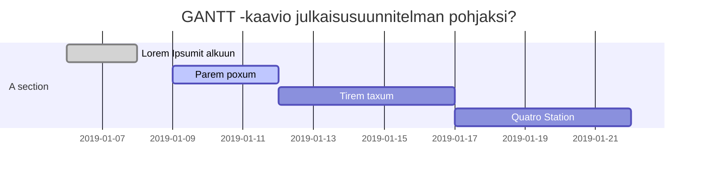

Ohjelmiston/palvelun vaatimusmäärittely

# TTOS0100 Kurssin harjoitustyö HT1 - TA-2019-3 

* M3268
* 2019
* V.1.0.0.1

## Sisällysluettelo 

**Pidä sisällysluettelo kunnossa, eli päivitä sitä tarpeen mukaan! Huomaa MarkDown-ankkurilinkitys**

* [Tuotteen kuvaus](#Johdatus)
* [Palvelukuvaus](#Palvelukuvaus)
* [Asiakastarina](#Johdatus)
* [Sidosryhmät ja profiilikuvaukset]()
* [Sidosryhmäkuva - 1](https://gitlab.labranet.jamk.fi/m3268---vuosi-2019/ttos0100---2019-toteutus/blob/master/dokumentit/02-vaatimusmaarittely/kuvat/CustomerMapV1.md)
* [Sidosryhmäkuva - 2](https://gitlab.labranet.jamk.fi/m3268---vuosi-2019/ttos0100---2019-toteutus/blob/master/dokumentit/02-vaatimusmaarittely/kuvat/StakeHolderMapV1.md)
* [Palvelu/asiakaspolku]()
* [Yleinen käyttötapaus]()
* [Yleiset toiminnalliset vaatimukset]()
* [Yleiset ei-toiminnalliset vaatimukset]()
* [Palvelu MockUp]()
* [Tärkeimmät ominaisuudet]()
* [Julkaisun suunnitelma]()
* [Palvelun/ohjelmiston arkkitehtuuri]()
* [Testaus ja laadunvarmistus]()
* [Lähteet]()

# Johdatus

**Kerro millaisesta projektista on kyse, hieman taustaa ja aiheeseen olennaisesti liittyviä asioita?**

**Älä käytä tilaajien todellisia nimiä vaan muuta henkilötiedot ja toimeksiantajan viralliset tiedot**

Tilauksen on tehnyt Orcs of the Middle-Earth. Projektissa lähdettiin kehittämään kävelykuntoutusrobottia. Tavoitteena on luoda toimiva, eri tilanteita huomioiva, ergonominen ja ekonominen ratkaisu asiakastarpeisiin.

Kävelykuntoutusterapiassa on useanlaisia potilaita, eri tilanteissa, vaatimustarpeissa ja käyttötarkoituksen tarpeessa. Siksi on tärkeää pyrkiä tuottamaan tuote, joka soveltuu moneen eri käyttötarpeeseen.
Käytännössä se tarkoittaa sitä, että kävelykuntoutusrobotin tulee olla säädettävissä ja pystyä huomiomaan käytön vaatimukset. Lisäksi sen täytyy pystyä keräämään dataa ja kääntää se kuntouttajille hyödylliseksi dokumentiksi.

## Palvelunkuvaus

Projektissa kehitellään kävelykuntoutusrobottia Fauxton sairaalan tilaamana. Tavoitteena on tuottaa sellainen tuote, joka vastaa asiakkaan odotuksia ja vaatimuksia, sekä osaa huomioida myös sanattomia asiakastarpeita.

Tälläisiä asiakastarpeita ovat mm. logistiset ominaisuudet kuten kävelykuntoutusrobotin ergonomisuus ja siirrettävyys, kävelykuntoutusrobotin huolto ja kävelykuntoutusrobotin turvallisuuteen, luotettavuuteen ja toiminnallisuuteen viittaavat tekijät.
Lisäksi on huomioitava tuotetta käyttävän asiakaskunnan yksilötarpeet, kuten värisokeus, sokeus, kuurous, erikielisyys, liikuntarajoitteisuus ja muut vastaavat piirteet.

Palvelun avulla voidaan avustaa tilaajan asiakaskuntaa kävelykuntoutuksen terapiassa ja auttaa työntekijöitä ymmärtämään asiakkaiden yksilöllisistä asiakastarpeista.
Asiakaskunnan kannalta kävelykuntoutusrobootin tehtävä olisi auttaa heitä kuntoutumaan kävelykuntoutusterapiassa ja vastata heidän odotuksia ja tarpeita kussakin tilanteessa.
Tilaajan kannalta on huomioitava projektin vaatimuusmäärittelyt, arkkitehtuuri, toteutettavuus käytännöllisesti ja taloudellisesti.

## Vaatimusmäärittelytyön tilaaja

__Sidosryhmä/Yritys/Yhteisö ilman henkilön nimeä!__

##### Fauxston hospital:

* Yrityksen johtaja-kunta.
* Kävelykuntoutusterapian osastovastaava.
* Kavelykuntoutusterapeutti.
* Kävelykuntoutusterapiasta vastaava lääkäri.
* Kuntaryhmän projektivastaavat.
* Kuntatalous vastaavat.
* Sijoittajat.

##### Kuntoutusterapian potilas:

* Raajarikosta kärsivä potilas tarvitsee robotin lievää tukea.
* Halvauksesta kärsivä potilas tarvitsee laajamittaista tukea robotilta ja sen ohjelmistolta.
* Motorisesta sairaudesta sairastava potilas, joka tarvitsee robotilta tukea kognitiivisten ja motoristen toimintojen kehittämiseen ja hallintaan.
* Jalkaproteesin saanut henkilö tarvitsee apua tottuakseen uuteen proteesiin.
* Olen hiljattain sokeutunut ja tarvitsen kävelyterapiaa kävelyn harjoitteluun ja sijaintini tunnistamiseen.
* Olen kuuro ja käyn kävelyterapiassa muutamankerran sopeutuakseni ympäristööni,
* I am a foreigner and I do not speak good English or Finnish but I can speak fluent German. It makes communicating in walking therapy hard.
* Olen värisokea ja minua harmittaa kuinka usein kohtaan ongelmaani kävelyterapiassakin.

## Vaatimusmäärittelyn toimittaja

__Kerro lyhyesti itsestäsi (tarvittaessa pseudonyyminä) taiesim. kuvitteellisen yrityksen työntekijänä__

Olen projektiryhmän suunnittelija ja konsultti Robot and Artificial Intelligence Development Organization yrityksessä.

## Valitut asiakastarinat

**Kerro palvelun käytöstä eri asiakasprofiilien/sidoryhmäedustajinen näkökulmasta**

A: Olen 34-vuotias proteesin saanut mies, ja käyn kävelykuntoutusterapiassa harjoittelemassa proteesin käyttöä. 

B: Olen hipiästä alaspäin halvaantunut 46-vuotias nainen, ja käyn kävelykuntoutusterapiassa opettelemassa uudelleen kävelemään.

C: Pienestä asti olen sairastanut harvinaista motoorista sairausta ja käyn kävelykuntoutusterapaissa viikoittain.

E: Jouduin onnettomuuteen ja käyn kuntoutusterapaissa osana parantumistani.

D: I moved into Finland few years ago and I got into accident. I go to walking therapy and use a robot  to help and guide me back into fit shape.

F: Olen hiljattain sokeutunut kävelykuntoutusterapian asiakas. Käyn siellä harjoittelemassa uuta elämäntilannettani.

G: Olen kuuro ja liikuntarajoitteinen. Käyn kävelykuntoutusterapiassa harjoittelemassa liikkumista parantuakseni.

H: Olen kävelykuntoutusterapeutti ja tehtäväni on vastata potilaiden kävelykuntoutuksesta.

I: Olen kävelykuntoutusrobotin tilaaja, ja tavoitteena olisi saada toimiva kävelykuntoutus-robotti palvelu kävelykuntoutusterpian asiakaskunnalle.

J: Olen sijoittaja, ja haluan selvittää onko tuote talouskelpoinen.

## Yleinen sidosryhmäkuva (Stakeholder map)

__Kerätään kaikki sidosryhmät yhteen kuvaan ja pohditaan erityisesti mikä on ko. ryhmän/edustajan motivaatio liittyen palveluun__

## Tunnistetut sidosryhmäkuvaukset (Stakeholders) 

**Kuvaa valitut sidosryhmät ja niihin liittyvät profiilikuvaukset** 

**Muista kirjata kuvauksiin erityisesti sidosryhmän motivaatio! Eli miksi sidosryhmä syy käyttää/soveltaa palvelua**

* [Profiili - 1](http://m3268---vuosi-2019.pages.labranet.jamk.fi/ttos0100---2019-toteutus/02-vaatimusmaarittely/Profiilit%20ja%20sidosryhm%C3%A4t/Profiili-1/)
* [Profiili - 2](http://m3268---vuosi-2019.pages.labranet.jamk.fi/ttos0100---2019-toteutus/02-vaatimusmaarittely/Profiilit%20ja%20sidosryhm%C3%A4t/Profiili-2/)
* [Profiili - 3](http://m3268---vuosi-2019.pages.labranet.jamk.fi/ttos0100---2019-toteutus/02-vaatimusmaarittely/Profiilit%20ja%20sidosryhm%C3%A4t/Profiili-3/)
* [Profiili - 4](http://m3268---vuosi-2019.pages.labranet.jamk.fi/ttos0100---2019-toteutus/02-vaatimusmaarittely/Profiilit%20ja%20sidosryhm%C3%A4t/Profiili-4/)
* [Profiili - 5](http://m3268---vuosi-2019.pages.labranet.jamk.fi/ttos0100---2019-toteutus/02-vaatimusmaarittely/Profiilit%20ja%20sidosryhm%C3%A4t/Profiili-5/)
* [Profiili - 6](http://m3268---vuosi-2019.pages.labranet.jamk.fi/ttos0100---2019-toteutus/02-vaatimusmaarittely/Profiilit%20ja%20sidosryhm%C3%A4t/Profiili-6/)

## Palvelu/asiakaspolku (Customer Journey/Path)

**Käy läpi yksittäinen asiakaspolku piirtäen se esim Swimlane/BluePrint/tilakone -kuvauksena. Asiakaspolku voi olla aluksi tekstimuotoinen ja se piirretään sen pohjalta**

**Asiakaspolun voi kirjoittaa auki käyttäen aiemmin määriteltyjä profiileja..** 

Asiakas [Profiili - 1](http://m3268---vuosi-2019.pages.labranet.jamk.fi/ttos0100---2019-toteutus/02-vaatimusmaarittely/Profiilit%20ja%20sidosryhm%C3%A4t/Profiili-1/) on ongelma. Hänellä diagnisoidaan sairaus tai hän joutuu onnettomuuteen.
Ensiapuun hakeuduttuaan ensihoitaja kertoo, että hän tulee tarvitsemaan kävelykuntoutusterapiaa ja ensihoitaja antaa potilaalle tarvittavat tiedot missä sellaista kävelykuntoutusterapiaa järjestetään.
Asiakas [Profiili - 1](http://m3268---vuosi-2019.pages.labranet.jamk.fi/ttos0100---2019-toteutus/02-vaatimusmaarittely/Profiilit%20ja%20sidosryhm%C3%A4t/Profiili-1/) varaa ajan kävelykuntoutusterapiaan.
Kävelykuntoutusterapiasta vastaa [Profiili - 2](http://m3268---vuosi-2019.pages.labranet.jamk.fi/ttos0100---2019-toteutus/02-vaatimusmaarittely/Profiilit%20ja%20sidosryhm%C3%A4t/Profiili-2/), eli kävelykuntoutusterapeutti.
Kävelykuntoutusterapeutin avulla he työskentelevät yhdessä [Profiili - 1](http://m3268---vuosi-2019.pages.labranet.jamk.fi/ttos0100---2019-toteutus/02-vaatimusmaarittely/Profiilit%20ja%20sidosryhm%C3%A4t/Profiili-1/) paranemisprosessin eteen.
Kuntoutuksen aikana [Profiili - 2](http://m3268---vuosi-2019.pages.labranet.jamk.fi/ttos0100---2019-toteutus/02-vaatimusmaarittely/Profiilit%20ja%20sidosryhm%C3%A4t/Profiili-2/)
kuuntelee [Profiili - 1](http://m3268---vuosi-2019.pages.labranet.jamk.fi/ttos0100---2019-toteutus/02-vaatimusmaarittely/Profiilit%20ja%20sidosryhm%C3%A4t/Profiili-1/) asikaskokemuksia.
Kun kävelykuntoutusterapia loppuu potilaan kohdalta (profiili 1), lähettää kävelykuntoutusterapeutti (profiili 2) vielä palautetta palveluista ja tuotteista vastaaville tahoille.

Esim. 

Sed ut [Profile 1](stakeholder-profile1.md) perspiciatis unde omnis iste natus error sit voluptatem accusantium doloremque laudantium, 
totam rem aperiam, eaque ipsa quae ab illo inventore veritatis et quasi architecto beatae vitae 
dicta sunt explicabo. Nemo enim ipsam voluptatem quia voluptas sit aspernatur aut odit aut fugit, 
sed quia consequuntur magni dolores eos qui [Profile 1](stakeholder-profile1.md) ratione voluptatem sequi nesciunt. 
Neque porro quisquam est, [Profile 3](stakeholder-profile3.md)
qui dolorem ipsum quia dolor sit amet, consectetur, adipisci velit, sed quia non numquam eius modi tempora 
incidunt ut labore et dolore magnam aliquam quaerat voluptatem. Ut enim ad minima veniam, 
quis nostrum exercitationem ullam corporis suscipit laboriosam, nisi ut aliquid ex ea commodi consequatur?

**Polkuja kannattaa määritellä useampia useita eri tilanteiden pohjalta. Yhteen kuvaukseen ei kannata upottaa liikaa tapahtumia**

* Mieti onko mahdollista hyödynnetään jotain ulkopuolista palvelua kuvauksen apuna?

Esim. Canvanizer https://canvanizer.com

# Vaatimukset, käyttötapaukset ja ominaisuudet

## Tuotteen järjestelmävaatimukset ja mahdolliset rajoitukset (Key Requirements and restrictions)

__Kirjaa tähän tärkeimmät vaatimukset suunnitteltuun palveluun liittyen__

Kävelykuntoutusrobotin tulee soveltua käyttöön. Sen pitää pystyä tukemaan asiakkaita, keräämään dataa ja esittämään sitä visuaalisesti.
Sen tulee olla kestävä, helppohuoltoinen ja luotettava. Tuotteen tulee pystyä olemaan helppokäyttöinen ja ketterä soveltuakseen erillaisiin kävelykuntoutusterapian haasteisiin ja asiakaskunnan tarpeisiin.
Sen pitää pystyä myös olemaan helposti ymmärrettävissä ja säädettävissä, jos esimerkiksi asiakas onkin eri kokoinen, värisokea tai vaikka ulkomaalainen.
Laitteen kohdat tulee olla helposti tunnistettavissa sokeillekkin asiakkaille, ja potilaalle näytettävän visuaalisen representaation tulee olla selkeää niin, että kuurokin ymmärtää mistä on kyse.

Voit esittää ne taulukossa tai viitata [yhteen](pohjat/pohja-vaatimuslistalle.md) laajempaan kokonaisuuteen

| VaatimusID | Tyyppi | Kuvaus | Ominaisuus johon vaikuttaa |								
|:-:|:-:|:-:|:-:|
| SYSTEM-REQ-0001 | System Requirement | Laitteen tulee soveltua neurologisesti vaikeavammaiselle, erityisesti kävelykuntoutuksen akuuttivaiheeseen. | [Kirjautuminen ft1](ft1-ominaisuus.md) |
| SYSTEM-REQ-0002 | System Requirement | Laitteen tulee olla robottiavusteinen, varustettuna mekaanisesti säädettävillä ortooseilla. ||
| SYSTEM-REQ-0003 | System Requirement | Laitteen tulee olla robottiavusteinen, varustettuna mekaanisesti säädettävillä ortooseilla. ||
| SYSTEM-REQ-0004 | System Requirement | Kävelyrobotin tulee sisältää muun muassa ortoosit, juoksumaton ja painonkevennysjärjestelmän. ||
| SYSTEM-REQ-0005 | System Requirement | Tarjottavien laitteiden on täytettävä lain terveydenhuollon laitteista ja tarvikkeista ja siihen tehtyjen muutosten sekä viranomaisten asettamat vaatimukset sairaanhoitotarvikkeille ja laitteille.||
| SYSTEM-REQ-0006 | System Requirement | Tarjottujen tuotteiden tulee täyttää Suomessa voimassaolevat työ- ja käyttöturvallisuusvaatimukset. ||
| SYSTEM-REQ-0007 | System Requirement | Tarjottujen tuotteiden tulee olla CE-merkittyjä. ||
| SYSTEM-REQ-0008 | System Requirement | Laitteessa on oltava dynaaminen painonkevennysjärjestelmä, jota on voitava käyttää kaukosäätimellä. ||
| SYSTEM-REQ-0009 | System Requirement | Laitteen mukana tulee toimittaa 4 kappaletta valjaita erikokoisille kuntoutujille, kokojen tulee olla S, M, L ja XL tai vastaavat.||
| SYSTEM-REQ-0010 | System Requirement | Laitteen juoksumatolle on päästävä helposti pyörätuolilla ramppia pitkin. ||
| SYSTEM-REQ-0011 | System Requirement | Laitteen tulee soveltua 130 kg painoiselle henkilölle ja mahdollistaa 200 cm pituisen potilaan painokevennetyn kävelyn. ||
| SYSTEM-REQ-0012 | System Requirement | Laitteen täytyy soveltua painokevennettyyn kävelymattokuntoutukseen robottiavusteisesti, mutta myös ilman robottia painekevennetyn kävelyn harjoitteluun. ||
| SYSTEM-REQ-0013 | System Requirement | Laitteessa täytyy olla virtuaalinen biofeedback-ohjelmisto sekä näyttötaulu tai muu vastaava tekninen ratkaisu. ||
| SYSTEM-REQ-0014 | System Requirement | Ohjelmistojen tulee soveltua toimintakyvyltään eritasoisille kuntoutujille. ||
| SYSTEM-REQ-0015 | System Requirement | Laitteella tulee pystyä mittaamaan vähintään seuraavat: kävelymatka, lihasten aktiivisuus, lihasten jäykkyys/vastus, alaraajanivelten liikelaajuudet ja isometriset liikevoimat. ||
| SYSTEM-REQ-0016 | System Requirement | Laitteessa tulee olla mahdollisuus tallentaa vähintään 10 kuntoutujan mittaustulokset ja harjoitushistoria myöhempää dokumentointia varten (tallenteet tulee saada myös tulostettua). ||
| SYSTEM-REQ-0017 | System Requirement | Laitteella tai lisälaitteella on pystyttävä ohjaamaan mekaanisesti lantion sivusuuntaista liikettä painonsiirron simuloimiseksi sekä lantion kiertoa.||
| SYSTEM-REQ-0018 | System Requirement | Laitteessa on oltava tietokoneyhteydellä ja voimasensoreilla varustetut alaraajaortoosit. ||

# Oleelliset huomioitavat rajoitteet

| Id | Vaatimuksen kuvaus | kategoria | Vastuullinen |
|:-:|:-:|:-:|:-:|
| CONSTRAINT-REQ-S00000 | Constrain | Tuote on ergonominen.  | [Kirjautuminen ft1](ft1-ominaisuus.md) |
| CONSTRAINT-REQ-S00001 | Constrain | Tuote on skaalautuva. ||
| CONSTRAINT-REQ-S00002 | Constrain | Tuotteen on helppokäyttöinen. ||
| CONSTRAINT-REQ-S00003 | Constrain | Tuote on asiakasturvallinen. ||
| CONSTRAINT-REQ-S00004 | Constrain | Tuote on tietoturvallinen. ||
| CONSTRAINT-REQ-S00005 | Constrain | Tuote on siirrettävissä. ||
| CONSTRAINT-REQ-S00006 | Constrain | Tuote on ketterä. ||

## Tärkeimmät käyttötapaukset (General Use Cases)

**Millaisia ovat tärkeimmät käyttötapaukset (Use Caset) tuotteeseen/palveluun liittyen? Muista, ettei käyttötapauksella ei tarkoiteta käyttökohdetta/soveltamiskohdetta**

Tärkeimmissä tapauksissa on kuntoutusrobotin käyttöä aktiivisimmin käyttävät tahot. Nämä tahot ovat potilas [Profiili - 1](http://m3268---vuosi-2019.pages.labranet.jamk.fi/ttos0100---2019-toteutus/02-vaatimusmaarittely/Profiilit%20ja%20sidosryhm%C3%A4t/Profiili-1/) ja kävelykuntouitusterapeutti [Profiili - 2](http://m3268---vuosi-2019.pages.labranet.jamk.fi/ttos0100---2019-toteutus/02-vaatimusmaarittely/Profiilit%20ja%20sidosryhm%C3%A4t/Profiili-2/).
Kävelykuntoutusterapeutti saa työpaikalleen kävelykuntoutusrobotin ja työryhmän kanssa he alkavat analysoimaan miten uusi työkalu voidaan parhaiten integroida osana kuntoutusohjelmaa.
Kun kuntoutusrobotti läpäisee tarvittavat testit, voi kävelykuntoutuksesta vastaava työryhmä alkaa käyttämään sitä osana kuntoutusohjelmaa.
Kävelykuntoutusterapiaan päästessä potilas aloittaa kävelyrobotin käyttämisen osana kuntoutusterapian ohjelmaa kävelykuntousterapeutin ohjeistuksen tukemana.
Käytön aikana potilas ja terapeutti ovat keskenään vuorovaikutuksessa ja toimivat yhdessä tavoitteena potilaan parantuminen. Samalla prosessista kerätään tarpeellista tietoa eri osa-aluista.
Kun kuntoutusohjelma loppuu, koostetaan kaikki tiedot omiin luokkiinsa ja jälleenvälitetään sitä eteenpäin palvelun laadun parantamiseksi ja tuotekehittelyä varten.

* [Käyttötapaus 1 - Potilas hakee kuntoutuspalvelua](https://gitlab.labranet.jamk.fi/m3268---vuosi-2019/ttos0100---2019-toteutus/blob/master/dokumentit/02-vaatimusmaarittely/Usecases/Usecase%20-%201.md)
* [Käyttötapaus 2 - Kävelykuntoutusterapeuttii hyödyntää kuntoutusrobottia osana terapiaa](https://gitlab.labranet.jamk.fi/m3268---vuosi-2019/ttos0100---2019-toteutus/blob/master/dokumentit/02-vaatimusmaarittely/Usecases/Usecase%20-%202.md)

## Palveluun liittyvät tärkeimmät toiminnalliset vaatimukset (Functional Requirements)

Toiminnallisia vaatimuksia liittyvät tuotteen toimintoihin käytännössä. Laitteen pitää pystyä olemaan turvallinen asiakkaalle ja käyttäjälle, eli se ei saa olla liian hutera tai liian kireä.
Se ei saa olla liina raskas ja/tai kömeplö. Laitteen tulee olla mukava ja luonnollinen käyttää ja sen pitää osata mukailla ihmisen jalan rakennetta tavalla, joka tukee sitä. Myös silloinkin kun kyseessä on jalka-proteesi.
Laitteen tulee myös olla sokealle helposti hahmoteltavissa ja tunnistettavissa, eli käyttäjälle relevantit kohdat kuten juoksumatto ja käsitukitangot tulee olla helposti käsillä, samalla kun tekniset osat tulee olla laitteiston sisällä.
Laitteen pitää pystyä olemaan tarpeaksi ketterä, se ei siis saa vaikeuttaa kuntoutumisprosessissa käyvän kävelyn kokemusta ja harjoittelua. 

Voit esittää ne taulukossa tai viitata [yhteen](pohjat/pohja-vaatimuslistalle.md) laajempaan kokonaisuuteen

| VaatimusID | Tyyppi | Kuvaus | Ominaisuus johon vaikuttaa |								
|:-:|:-:|:-:|:-:|
| FUNCTIONAL-REQ-C0001 | Functional Requirement | Potilas kokee käytön vaivattomaksi. | [Kirjautuminen ft1](ft1-ominaisuus.md) |
| FUNCTIONAL-REQ-C0002 | Functional Requirement | Tuote ei vahingoita potilaita. ||
| FUNCTIONAL-REQ-C0003 | Functional Requirement | Tuote tukee potilaiden raajoja. ||
| FUNCTIONAL-REQ-C0004 | Functional Requirement | Laite on ketterä. ||
| FUNCTIONAL-REQ-C0005 | Functional Requirement | Laitetta voidaan säätää ja se skaalautuu. ||
| FUNCTIONAL-REQ-C0006 | Functional Requirement | Laite pystyy esittämään kuntoutusohjelman selkeästi monelle eri aistille. ||
| FUNCTIONAL-REQ-C0007 | Functional Requirement | Potilas kokee olonsa turvalliseksi laitteen käytön aikana. ||
| FUNCTIONAL-REQ-C0008 | Functional Requirement | Kuntouttaja pystyy helposti ymmärtämään miten laite toimii. ||
| FUNCTIONAL-REQ-C0009 | Functional Requirement | Laite ei ole liian kiristävä, raskas tai kömpelö aiheuttaakseen vaaratilanteita. ||
| FUNCTIONAL-REQ-C0010 | Functional Requirement | Käyttöä voidaan soveltaa tarvittaessa. ||

## Palveluun liittyvät tärkeimmät ei-toiminnalliset vaatimukset (Non Functional Requirements)

Voit esittää eri vaatimuksia erillisessä taulukossa tai viitata tässä [yhteen](pohjat/pohja-vaatimuslistalle.md) laajempaan taulukkoon..

Tuotteen ehdottomia ei-toiminnallisia vaatimuksia on sen käyttöön ja huoltoon liittyvät piirteet. Laitteen on oltava ergonominen käyttää sekä potilaan, että terapeutin näkökulmasta.
Sen tulee olla intuitiivinen, eli tiedot tulee nähdä selkeästi ja vaivattomasti, ja sen esitys näytölle tulee olla loogista, selkeää, ja ulkoasun tarkoin mietittyä.
Laitteen tulee myös olla logistisesti realistinen, eli se ei saa olla liian hankala purkaa ja jälleenkasata, se ei saa olla liian vaikea huoltaa tai tarvittaessa korvata epäkelvot osat uusilla toimivilla osilla.
Laitten pitää olla sen verran kevyt, että se voidaan siirtää tarvittaessa jos tilanne sitä vaatii.
Se ei myöskään saa olla ekonomisesti, eli taloudellisesti liian resurssikallis. Osat tulee olla kohtuullisen hintaisia, jotta projektin materiaalinen toteutus on realistinen.

### Suorituskyky? (Performance)

Tuotteen tulee kestää käyttö ja olla käyttäjäystävällinen ja turvallinen laite.

Voit esittää eri vaatimuksia erillisessä taulukossa tai viitata tässä [yhteen](pohjat/pohja-vaatimuslistalle.md) laajempaan taulukkoon..

| VaatimusID | Tyyppi | Kuvaus | Ominaisuus johon vaikuttaa |								
|:-:|:-:|:-:|:-:|
| PERFORMANCE-REQ-0000 | Non-Functional Performance | Logit käyttäjän sessiosta. | [Kirjautuminen ft1](ft1-ominaisuus.md) |								
| PERFORMANCE-REQ-0001 | Non-Functional Performance | Käyttäjätunnukset vähintään 10 potilaasta. ||
| PERFORMANCE-REQ-0002 | Non-Functional Performance | Käyttäjätietoa vähintään 10 potilaasta. ||
| PERFORMANCE-REQ-0003 | Non-Functional Performance | Näyttöruusdun presentaatio on selkeää. ||

### Tietoturva?

qui dolorem ipsum quia dolor sit amet, consectetur, adipisci velit, sed quia non numquam eius modi tempora 
incidunt ut labore et dolore magnam aliquam quaerat voluptatem. Ut enim ad minima veniam, 
quis nostrum exercitationem ullam corporis suscipit laboriosam, nisi ut aliquid ex ea commodi consequatur?

Voit esittää eri vaatimuksia erillisessä taulukossa tai viitata tässä [yhteen](pohjat/pohja-vaatimuslistalle.md) laajempaan taulukkoon..

| VaatimusID | Tyyppi | Kuvaus | Ominaisuus johon vaikuttaa |								
|:-:|:-:|:-:|:-:|
| SECURITY-REQ-0001 | Non-Functional Security | Henkilokohtainen tieto tulee turvata instituutin tietoturvastandardien mukaisesti. | [Kirjautuminen ft1](ft1-ominaisuus.md) |								
| SECURITY-REQ-0002 | Non-Functional Security | Tiedon tulee epäsuorasti viitata henkilöihin potilastunnuksilla, ei henkilötiedoilla. ||
| SECURITY-REQ-0003 | Non-Functional Security | Tieto tulee olla irjoitettavissa, ylikirjoitettavissa ja poistettavissa milloin vain. ||
| SECURITY-REQ-0004 | Non-Functional Security | Tiedosta tehdään automaattisesti varmuuskopio muualle kaiken varalta. ||
| SECURITY-REQ-0005 | Non-Functional Security | Laitteessa tulee olla sisäänkirjautumisvaatimus käyttöä varten. ||
| SECURITY-REQ-0006 | Non-Functional Security | Tieto tallentuu tietokantaan, mistä ohjelma hakee sitä kutsusta. ||
| SECURITY-REQ-0007 | Non-Functional Security | Tuotteessa tulee olla teollisuustason virustentorjuntaohjelma ja tietoturvaa ylläpitävä ohjelma. ||

### Käytettävyys

qui dolorem ipsum quia dolor sit amet, consectetur, adipisci velit, sed quia non numquam eius modi tempora 
incidunt ut labore et dolore magnam aliquam quaerat voluptatem. Ut enim ad minima veniam, 
quis nostrum exercitationem ullam corporis suscipit laboriosam, nisi ut aliquid ex ea commodi consequatur?

Voit esittää eri vaatimuksia erillisessä taulukossa tai viitata tässä [yhteen](pohjat/pohja-vaatimuslistalle.md) laajempaan taulukkoon..

| VaatimusID | Tyyppi | Kuvaus | Ominaisuus johon vaikuttaa |								
|:-:|:-:|:-:|:-:|
| USABILITY-REQ-0000 | Non-Functional Usability | Käyttöliittymän on toimittava myös ääniohjattuna, koska käyttäjillä saattaa olla näkövammoja. |  [Kirjautuminen ft1](ft1-ominaisuus.md) | |	
| USABILITY-REQ-0001 | Non-Functional Usability | Käyttöliittymän on selkeästi esitettävä tieto käyttäjille. Käyttäjä voi olla kuuro. ||
| USABILITY-REQ-0002 | Non-Functional Usability | Käyttöliittymän tulee pystyä vaihtamaan käytettyä kieltä tarvittaessa. Kaikki eivät ole samankielisiä. ||
| USABILITY-REQ-0003 | Non-Functional Usability | Käyttöliittymän tulee pystyä vaihtamaan esityksen väriteemaa, jos käyttäjä on värisokea. ||

### Testattavuus

| VaatimusID | Tyyppi | Kuvaus | Ominaisuus johon vaikuttaa |								
|:-:|:-:|:-:|:-:|
| TESTABILITY-REQ-0000 | Non-Functional Testability | Käyttäjärekisteri on kyettävä palauttamaan alkutilaan ennen testien ajoa  | [Kirjautuminen ft1](ft1-ominaisuus.md)	 |	
| TESTABILITY-REQ-0001 | Non-Functional Testability | Laite tulee pystyä käynnistämään ja pysäyttämään tarpeen mukaan testien tekemiseksi. ||	
| TESTABILITY-REQ-0002 | Non-Functional Testability | Laitteen toimivuutta tulee pystyä mittaamaan eri mittareilla, kuten nopeus, vakaus ja perofrmanssi. ||	
| TESTABILITY-REQ-0003 | Non-Functional Testability | Asetukset tulee pystyä nollaamaan ja palauttamaan tarvittaessa. ||

## Palvelu MockUp-prototyyppi

__Kokonaispalvelun MockUp-kuva?__

qui dolorem ipsum quia dolor sit amet, consectetur, adipisci velit, sed quia non numquam eius modi tempora 
incidunt ut labore et dolore magnam aliquam quaerat voluptatem. Ut enim ad minima veniam, 
quis nostrum exercitationem ullam corporis suscipit laboriosam, nisi ut aliquid ex ea commodi consequatur?

## Tärkeimmät tunnistetut ominaisuudet/piirteet (Features)

qui dolorem ipsum quia dolor sit amet, consectetur, adipisci velit, sed quia non numquam eius modi tempora 
incidunt ut labore et dolore magnam aliquam quaerat voluptatem. Ut enim ad minima veniam, 
quis nostrum exercitationem ullam corporis suscipit laboriosam, nisi ut aliquid ex ea commodi consequatur?

** Mieti ovatko kaikki ominaisuudet tarpeellisia?**

| Ominaisuus | Prioriteetti | Muuta |
| :-: | :-: | :-: |
| [Ominaisuus - 1](https://gitlab.labranet.jamk.fi/m3268---vuosi-2019/ttos0100---2019-toteutus/blob/master/dokumentit/02-vaatimusmaarittely/Ominaisuudet/Ominaisuus%20-%201.md) | Pakollinen | |
| [Ominaisuus - 2](https://gitlab.labranet.jamk.fi/m3268---vuosi-2019/ttos0100---2019-toteutus/blob/master/dokumentit/02-vaatimusmaarittely/Ominaisuudet/Ominaisuus%20-%202.md) | Pakollinen | |
| [Ominaisuus 3](pohjat/pohja-ominaisuus.md) | Pakollinen | |
| [Ominaisuus 4](pohjat/pohja-ominaisuus.md) | Nice to Have | |
| [Ominaisuus 5](pohjat/pohja-ominaisuus.md) | | |

## Hyväksyntätestit

**Kiinnitetään alustavat hyväksyntätestit vaatimuksiin taulukon muodossa**

| VaatimusID | Testitapaus | Kuvaus |  |								
|:-:|:-:|:-:|:-:|
| USE-CASE-007,SYSTEM-REQ-0001,SYSTEM-REQ-0004, SYSTEM-REQ-0012 | [Test Case Id X](Linkki testiin) | Hyväksyntätesti  |
| USE-CASE-017,SYSTEM-REQ-0011,SYSTEM-REQ-0004, SYSTEM-REQ-0012 | [Test Case Id Y](Linkki testiin) | Hyväksyntätesti  |
| USE-CASE-011,USE-CASE-013,SYSTEM-REQ-0204, SYSTEM-REQ-0212 | [Test Case Id Z](Linkki testiin) | Hyväksyntätesti  |
| USE-CASE-002,SYSTEM-REQ-0301,SYSTEM-REQ-0304, SYSTEM-REQ-0312 | [Test Case Id O](Linkki testiin) | Hyväksyntätesti  |

## Julkaisun suunnitelma

Perinteinen listaus

| Aika + Ominaisuuus | Kuvaus | Vastuu | Prioriteetti |
|:-:|:-:|:-:|:-:|
| 1.9.2019 [Ominaisuus - 1](https://gitlab.labranet.jamk.fi/m3268---vuosi-2019/ttos0100---2019-toteutus/blob/master/dokumentit/02-vaatimusmaarittely/Ominaisuudet/Ominaisuus%20-%201.md) | Projektivastaava | 1 |
| 1.10.2019 [Ominaisuus - 2](https://gitlab.labranet.jamk.fi/m3268---vuosi-2019/ttos0100---2019-toteutus/blob/master/dokumentit/02-vaatimusmaarittely/Ominaisuudet/Ominaisuus%20-%202.md) | Proejtkivastaava | 2 |
| 15.11.2019 [Ominaisuus - 3](pohjat/pohja-ominaisuus.md) | | |
| 5.12.2019 [Ominaisuus - 4](pohjat/pohja-ominaisuus.md) | | |

Tutustu Mermaid skriptiin?

# Palvelun/ohjelmiston arkkitehtuuri 

### Yleinen sijoittelunäkymä (Deployment diagram )

# Arkkitehtuuriin/teknologiaan liityvät vaatimukset

### Tekniset vaatimukset 

| Id | Vaatimuksen kuvaus | kategoria | Vastuullinen |
|:-:|:-:|:-:|:-:|
| TEK.REQ000 | Vaatimus? | Yllläpito | Kuka vastaa | 
| TEK.REQ001 | Vaatimus? | Tekninen | Kuka vastaa | 
| TEK.REQ002 | Vaatimus? | Käytettävyys | Kuka vastaa | 
| TEK.REQ003 | Vaatimus? | Käytettävyys | Kuka vastaa | 
| TEK.REQ004 | Vaatimus? | Käytettävyys | Kuka vastaa | 

### Ylläpito (Maintenance)

_Tähän kirjataan vaatimuksia, joiden merkitys tulee esiin vasta tuotteen julkaisun jälkeen. Miten tuotteen ylläpidettävyyttä parannetaan? Mitä pitää ottaa huomioon, että ylläpidettävyys on helpompaa__

| Id | Vaatimuksen kuvaus | kategoria | Vastuullinen |
|:-:|:-:|:-:|:-:|
| MNt.REQ000 | Huolto | Yllläpito | Huoltovastaavat | 
| MNT.REQ001 | Päivitys | Tekninen | Ohjelmistovastaavat | 
| MNT.REQ002 | Kehitys | Käytettävyys | Projektivastaavat | 
| MNT.REQ003 | Testattavuus | Käytettävyys | Testauksen vastaavat | 
| MNT.REQ004 | Taloudellinen tuki | Kestävyys | Talousvastaavat | 

### Tietokantakuvaus (Database ER-diagram)

 Tähän esim alustava __ER-kaavio__

# Testauksen vaatimukset (Testing requirements)

### Testattavuus

| Id | Vaatimuksen kuvaus | kategoria | Vastuullinen |
|:-:|:-:|:-:|:-:|
| TST.REQ001 | Toimiiko laite | Testattavuus | Kehittäjä/Projektivastaava | 
| TST.REQ001 | Kestääkö laite | Testattavuus | Kehittäjä/Projektivastaava | 
| TST.REQ001 | Onko laite luotettava | Testattavuus | Kehittäjä/Projektivastaava | 
| TST.REQ001 | Vastaako tuote tilaajan vaatimuksiin | Testattavuus | Kehittäjä/Projektivastaava | 
| TST.REQ001 | Vastaako tuote tilaajan vaatimuksiin | Testattavuus | Kehittäjä/Projektivastaava |
| TST.REQ001 | Vastaako tuote tilaajan vaatimuksiin | Testattavuus | Kehittäjä/Projektivastaava | 

# Tunnistetut riskit ja testikohteet

* Riski -> Testaustarve
* Vaatimus -> Testaustarve

### Kaikki vaatimukset listattuna

**Tähän osaan voidaan linkittää vaatimuslista, josta kaikki tunnistetut vaatimukset löytyvät**

* [Linkki vaatimuslistaan](pohjat/vaatimuslista.md)

### Dokumentit, standardit ja lähteet

qui dolorem ipsum quia dolor sit amet, consectetur, adipisci velit, sed quia non numquam eius modi tempora 
incidunt ut labore et dolore magnam aliquam quaerat voluptatem. Ut enim ad minima veniam, 
quis nostrum exercitationem ullam corporis suscipit laboriosam, nisi ut aliquid ex ea commodi consequatur?

*Lähteet/Standardit/Suositukset*

| ID | Linkki |  |  
|:-:|:-:|:-:|
| JHS 165 ICT | http://www.jhs-suositukset.fi/c/document_library/get_file?uuid=b8118ad7-8ee4-459a-a12b-f56655e4ab9d&groupId=14 | Vaatimusmäärittely |
| SO 9241-11 | https://fi.wikipedia.org/wiki/K%C3%A4ytett%C3%A4vyys  | Käytettävyys | 
| ISO9001 | https://www.sfs.fi/julkaisut_ja_palvelut/tuotteet_valokeilassa/iso_9000_laadunhallinta/iso_9001_2015  | - | 
| - | -  | - | 
