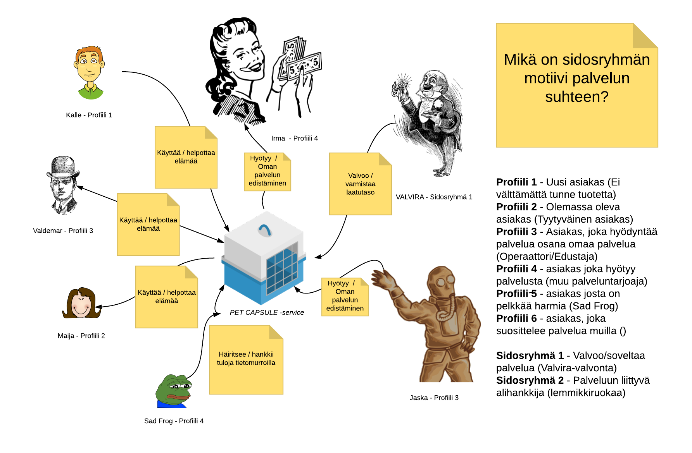
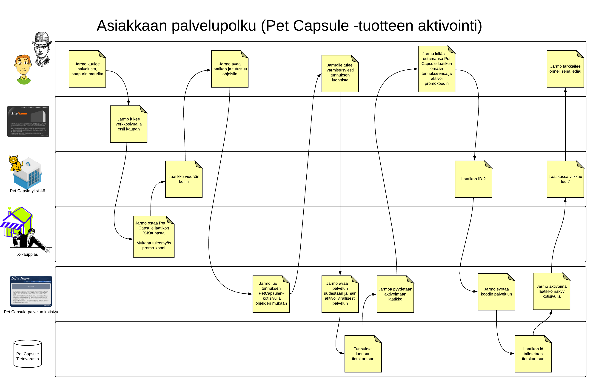

# PET CAPSULE -palvelun vaatimusmäärittely

* TTOS0100 Kurssin harjoitustyö HT0

# Tekijän Tiedot

* Nimimerkki
* Versionumero X.Y.Z

## Sisällysluettelo

* [Tuotteen kuvaus](#Johdatus)
* [Palvelukuvaus](#Palvelukuvaus)
* [Asiakastarina](#Johdatus)
* [Sidosryhmät ja profiilikuvaukset]()
* [Sidosryhmäkuva]()
* [Palvelu/asiakaspolku]()
* [Yleinen käyttötapaus]()
* [Yleiset toiminnalliset vaatimukset]()
* [Yleiset ei-toiminnalliset vaatimukset]()
* [Palvelu MockUp]()
* [Tärkeimmät ominaisuudet]()
* [Julkaisun suunnitelma]()
* [Palvelun/ohjelmiston arkkitehtuuri]()
* [Testaus ja laadunvarmistus]()
* [Lähteet]()

## Johdatus

Sed ut perspiciatis unde omnis iste natus error sit voluptatem accusantium doloremque laudantium, 
totam rem aperiam, eaque ipsa quae ab illo inventore veritatis et quasi architecto beatae vitae 
dicta sunt explicabo. Nemo enim ipsam voluptatem quia voluptas sit aspernatur aut odit aut fugit, 
sed quia consequuntur magni dolores eos qui ratione voluptatem sequi nesciunt. Neque porro quisquam est, 
qui dolorem ipsum quia dolor sit amet, consectetur, adipisci velit, sed quia non numquam eius modi tempora 
incidunt ut labore et dolore magnam aliquam quaerat voluptatem. Ut enim ad minima veniam, 
quis nostrum exercitationem ullam corporis suscipit laboriosam, nisi ut aliquid ex ea commodi consequatur?

* [Youtube-tarinaa](https://www.youtube.com/watch?v=0zVNZNbphfE&t=255s)
* [Palvelun rajaaminen](https://www.youtube.com/watch?v=fOlmrsp2iRc&t=5s)

### Palvelukuvaus

Sed ut perspiciatis unde omnis iste natus error sit voluptatem accusantium doloremque laudantium, 
totam rem aperiam, eaque ipsa quae ab illo inventore veritatis et quasi architecto beatae vitae 
dicta sunt explicabo. Nemo enim ipsam voluptatem quia voluptas sit aspernatur aut odit aut fugit, 
sed quia consequuntur magni dolores eos qui ratione voluptatem sequi nesciunt. Neque porro quisquam est, 
qui dolorem ipsum quia dolor sit amet, consectetur, adipisci velit, sed quia non numquam eius modi tempora 
incidunt ut labore et dolore magnam aliquam quaerat voluptatem. Ut enim ad minima veniam, 
quis nostrum exercitationem ullam corporis suscipit laboriosam, nisi ut aliquid ex ea commodi consequatur? 

### Vaatimusmäärittelytyön tilaaja

Sed ut perspiciatis unde omnis iste natus error sit voluptatem accusantium doloremque laudantium, 

### Vaatimusmäärittelyn toimittaja

quis nostrum exercitationem ullam corporis suscipit laboriosam, nisi ut aliquid ex ea commodi consequatur?

## Asiakastarina

* [Mikä ihme on asiakastarina](https://www.youtube.com/watch?v=m8WEoyyFUww&t=36s)

Sed ut perspiciatis unde omnis iste natus error sit voluptatem accusantium doloremque laudantium, 
totam rem aperiam, eaque ipsa quae ab illo inventore veritatis et quasi architecto beatae vitae 
dicta sunt explicabo. Nemo enim ipsam voluptatem quia voluptas sit aspernatur aut odit aut fugit, 
sed quia consequuntur magni dolores eos qui ratione voluptatem sequi nesciunt. Neque porro quisquam est, 
qui dolorem ipsum quia dolor sit amet, consectetur, adipisci velit, sed quia non numquam eius modi tempora 
incidunt ut labore et dolore magnam aliquam quaerat voluptatem. Ut enim ad minima veniam, 
quis nostrum exercitationem ullam corporis suscipit laboriosam, nisi ut aliquid ex ea commodi consequatur?

## Sidosryhmät (Stakeholders) ja profiilikuvaukset (Profile descriptions)

* [Sidosryhmistä](https://www.youtube.com/watch?v=VmotZXBdrDs&t=14s)

Sed ut perspiciatis unde omnis iste natus error sit voluptatem accusantium doloremque laudantium, 
totam rem aperiam, eaque ipsa quae ab illo inventore veritatis et quasi architecto beatae vitae 
dicta sunt explicabo. Nemo enim ipsam voluptatem quia voluptas sit aspernatur aut odit aut fugit, 
sed quia consequuntur magni dolores eos qui ratione voluptatem sequi nesciunt. Neque porro quisquam est, 
qui dolorem ipsum quia dolor sit amet, consectetur, adipisci velit, sed quia non numquam eius modi tempora 
incidunt ut labore et dolore magnam aliquam quaerat voluptatem. Ut enim ad minima veniam, 
quis nostrum exercitationem ullam corporis suscipit laboriosam, nisi ut aliquid ex ea commodi consequatur?

* [Profile 1](stakeholder-profile1.md)
* [Profile 2](stakeholder-profile2.md)
* [Profile 3](stakeholder-profile3.md)

## Sidosryhmäkuva (Stakeholder map)

Sed ut perspiciatis unde omnis iste natus error sit voluptatem accusantium doloremque laudantium, 
totam rem aperiam, eaque ipsa quae ab illo inventore veritatis et quasi architecto beatae vitae 
dicta sunt explicabo. Nemo enim ipsam voluptatem quia voluptas sit aspernatur aut odit aut fugit, 
sed quia consequuntur magni dolores eos qui ratione voluptatem sequi nesciunt. Neque porro quisquam est, 
qui dolorem ipsum quia dolor sit amet, consectetur, adipisci velit, sed quia non numquam eius modi tempora 
incidunt ut labore et dolore magnam aliquam quaerat voluptatem. Ut enim ad minima veniam, 
quis nostrum exercitationem ullam corporis suscipit laboriosam, nisi ut aliquid ex ea commodi consequatur?

## Palvelu/asiakaspolku (Customer Journey)

* 

Sed ut perspiciatis unde omnis iste natus error sit voluptatem accusantium doloremque laudantium, 
totam rem aperiam, eaque ipsa quae ab illo inventore veritatis et quasi architecto beatae vitae 
dicta sunt explicabo. Nemo enim ipsam voluptatem quia voluptas sit aspernatur aut odit aut fugit, 
sed quia consequuntur magni dolores eos qui ratione voluptatem sequi nesciunt. Neque porro quisquam est, 
qui dolorem ipsum quia dolor sit amet, consectetur, adipisci velit, sed quia non numquam eius modi tempora 
incidunt ut labore et dolore magnam aliquam quaerat voluptatem. Ut enim ad minima veniam, 
quis nostrum exercitationem ullam corporis suscipit laboriosam, nisi ut aliquid ex ea commodi consequatur?

## Tuotteen yleisiä vaatimuksia ja rajoituksia (General Requirements and restrictions)

Nemo enim ipsam voluptatem quia voluptas sit aspernatur aut odit aut fugit, 
sed quia consequuntur magni dolores eos qui ratione voluptatem sequi nesciunt. Neque porro quisquam est, 
qui dolorem ipsum quia dolor sit amet, consectetur, adipisci velit, sed quia non numquam eius modi tempora 
incidunt ut labore et dolore magnam aliquam quaerat voluptatem. Ut enim ad minima veniam, 

| Id | Vaatimuksen kuvaus | kategoria | Vastuullinen |
|:-:|:-:|:-:|:-:|
| GENREQ001 | Vaatimus? | Mikä osa-alue | Kuka vastaa | 
| GENREQ002 | Vaatimus? | Mikä osa-alue | Kuka vastaa | 
| GENREQ003 | Vaatimus? | Mikä osa-alue | Kuka vastaa | 
| GENREQ004 | Vaatimus? | Mikä osa-alue | Kuka vastaa | 
| GENREQ005 | Vaatimus? | Mikä osa-alue | Kuka vastaa | 

## Yleiset käyttötapaukset (General Use Cases)

* [Käyttötapauksista 1](https://www.youtube.com/watch?v=rADU4vWTfyY)
* [Käyttötapauksista 2](https://www.youtube.com/watch?v=rADU4vWTfyY)

Sed ut perspiciatis unde omnis iste natus error sit voluptatem accusantium doloremque laudantium, 
totam rem aperiam, eaque ipsa quae ab illo inventore veritatis et quasi architecto beatae vitae 
dicta sunt explicabo. Nemo enim ipsam voluptatem quia voluptas sit aspernatur aut odit aut fugit, 
sed quia consequuntur magni dolores eos qui ratione voluptatem sequi nesciunt. Neque porro quisquam est, 
qui dolorem ipsum quia dolor sit amet, consectetur, adipisci velit, sed quia non numquam eius modi tempora 
incidunt ut labore et dolore magnam aliquam quaerat voluptatem. Ut enim ad minima veniam, 
quis nostrum exercitationem ullam corporis suscipit laboriosam, nisi ut aliquid ex ea commodi consequatur?

## Palveluun liittyvät toiminnalliset vaatimukset (Functional Requirements)

Sed ut perspiciatis unde omnis iste natus error sit voluptatem accusantium doloremque laudantium, 
totam rem aperiam, eaque ipsa quae ab illo inventore veritatis et quasi architecto beatae vitae 
dicta sunt explicabo. Nemo enim ipsam voluptatem quia voluptas sit aspernatur aut odit aut fugit, 
sed quia consequuntur magni dolores eos qui ratione voluptatem sequi nesciunt. Neque porro quisquam est, 
qui dolorem ipsum quia dolor sit amet, consectetur, adipisci velit, sed quia non numquam eius modi tempora 
incidunt ut labore et dolore magnam aliquam quaerat voluptatem. Ut enim ad minima veniam, 
quis nostrum exercitationem ullam corporis suscipit laboriosam, nisi ut aliquid ex ea commodi consequatur?

| Id | Vaatimuksen kuvaus | kategoria | Vastuullinen |
|:-:|:-:|:-:|:-:|
| REQ001 | Vaatimus? | Mikä osa-alue | Kuka vastaa | 
| REQ002 | Vaatimus? | Mikä osa-alue | Kuka vastaa | 
| REQ003 | Vaatimus? | Mikä osa-alue | Kuka vastaa | 
| REQ004 | Vaatimus? | Mikä osa-alue | Kuka vastaa | 
| REQ005 | Vaatimus? | Mikä osa-alue | Kuka vastaa | 

## Palveluun liittyvät ei-toiminnalliset vaatimukset (Non Functional Requirements)

Sed ut perspiciatis unde omnis iste natus error sit voluptatem accusantium doloremque laudantium, 
totam rem aperiam, eaque ipsa quae ab illo inventore veritatis et quasi architecto beatae vitae 
dicta sunt explicabo. Nemo enim ipsam voluptatem quia voluptas sit aspernatur aut odit aut fugit, 
sed quia consequuntur magni dolores eos qui ratione voluptatem sequi nesciunt. Neque porro quisquam est, 
qui dolorem ipsum quia dolor sit amet, consectetur, adipisci velit, sed quia non numquam eius modi tempora 
incidunt ut labore et dolore magnam aliquam quaerat voluptatem. Ut enim ad minima veniam, 
quis nostrum exercitationem ullam corporis suscipit laboriosam, nisi ut aliquid ex ea commodi consequatur?

### Suorituskyky? (Performance)

qui dolorem ipsum quia dolor sit amet, consectetur, adipisci velit, sed quia non numquam eius modi tempora 
incidunt ut labore et dolore magnam aliquam quaerat voluptatem. Ut enim ad minima veniam, 
quis nostrum exercitationem ullam corporis suscipit laboriosam, nisi ut aliquid ex ea commodi consequatur?

| Id | Vaatimuksen kuvaus | kategoria | Vastuullinen |
|:-:|:-:|:-:|:-:|
| REQ00x | Vaatimus? | Suorituskyky | Kuka vastaa | 
| REQ00x | Vaatimus? | Suorituskyky | Kuka vastaa | 
| REQ00x | Vaatimus? | Suorituskyky | Kuka vastaa | 

### Luotettavuus?

qui dolorem ipsum quia dolor sit amet, consectetur, adipisci velit, sed quia non numquam eius modi tempora 
incidunt ut labore et dolore magnam aliquam quaerat voluptatem. Ut enim ad minima veniam, 
quis nostrum exercitationem ullam corporis suscipit laboriosam, nisi ut aliquid ex ea commodi consequatur?

| Id | Vaatimuksen kuvaus | kategoria | Vastuullinen |
|:-:|:-:|:-:|:-:|
| REQ00x | Vaatimus? | Luotettavuus | Kuka vastaa | 
| REQ00x | Vaatimus? | Luotettavuus | Kuka vastaa | 
| REQ00x | Vaatimus? | Luotettavuus | Kuka vastaa | 

### Tietoturva?

qui dolorem ipsum quia dolor sit amet, consectetur, adipisci velit, sed quia non numquam eius modi tempora 
incidunt ut labore et dolore magnam aliquam quaerat voluptatem. Ut enim ad minima veniam, 
quis nostrum exercitationem ullam corporis suscipit laboriosam, nisi ut aliquid ex ea commodi consequatur?

| Id | Vaatimuksen kuvaus | kategoria | Vastuullinen |
|:-:|:-:|:-:|:-:|
| REQ00x | Vaatimus? | Tietoturva | Kuka vastaa | 
| REQ00x | Vaatimus? | Tietoturva | Kuka vastaa | 
| REQ00x | Vaatimus? | Tietoturva | Kuka vastaa | 
| REQ00x | Vaatimus? | Tietoturva | Kuka vastaa | 
| REQ00x | Vaatimus? | Tietoturva | Kuka vastaa | 
| REQ00x | Vaatimus? | Tietoturva | Kuka vastaa | 

### Käytettävyys

qui dolorem ipsum quia dolor sit amet, consectetur, adipisci velit, sed quia non numquam eius modi tempora 
incidunt ut labore et dolore magnam aliquam quaerat voluptatem. Ut enim ad minima veniam, 
quis nostrum exercitationem ullam corporis suscipit laboriosam, nisi ut aliquid ex ea commodi consequatur?

| Id | Vaatimuksen kuvaus | kategoria | Vastuullinen |
|:-:|:-:|:-:|:-:|
| REQ00x | Vaatimus? | Käytettävyys | Kuka vastaa | 
| REQ00x | Vaatimus? | Käytettävyys | Kuka vastaa | 
| REQ00x | Vaatimus? | Käytettävyys | Kuka vastaa | 
| REQ00x | Vaatimus? | Käytettävyys | Kuka vastaa | 
| REQ00x | Vaatimus? | Käytettävyys | Kuka vastaa | 

## Palvelu MockUp-prototyyppi

qui dolorem ipsum quia dolor sit amet, consectetur, adipisci velit, sed quia non numquam eius modi tempora 
incidunt ut labore et dolore magnam aliquam quaerat voluptatem. Ut enim ad minima veniam, 
quis nostrum exercitationem ullam corporis suscipit laboriosam, nisi ut aliquid ex ea commodi consequatur?

## Tärkeimmät tunnistetut ominaisuudet (Features)

* 

qui dolorem ipsum quia dolor sit amet, consectetur, adipisci velit, sed quia non numquam eius modi tempora 
incidunt ut labore et dolore magnam aliquam quaerat voluptatem. Ut enim ad minima veniam, 
quis nostrum exercitationem ullam corporis suscipit laboriosam, nisi ut aliquid ex ea commodi consequatur?

| Ominaisuus | Prioriteetti | Muuta |
| :-: | :-: | :-: |
| [Ominaisuus 1 - Feature 1](FT1-ominaisuus.md) | | |
| [Ominaisuus 2](FT2-ominaisuus.md) | | |
| [Ominaisuus 3](FT3-ominaisuus.md) | | |
| [Ominaisuus 4](FT4-ominaisuus.md) | | |
| [Ominaisuus 5](FT5-ominaisuus.md) | | |
| [Ominaisuus 6](FT6-ominaisuus.md) | | |
| [Ominaisuus 7](FT7-ominaisuus.md) | | |

## Julkaisun suunnitelma

| Aika + Ominaisuuus | Kuvaus | Vastuu | Prioriteetti |
|:-:|:-:|:-:|:-:|
| 1.9.2018 [Ominaisuus 1](FT1-ominaisuus.md) | | |
| 1.10.2018 [Ominaisuus 2](FT2-ominaisuus.md) | | |
| 15.11.2018 [Ominaisuus 3](FT3-ominaisuus.md) | | |
| 5.12.2018 [Ominaisuus 4](FT4-ominaisuus.md) | | |

# Palvelun/ohjelmiston arkkitehtuuri 

### Yleinen sijoittelunäkymä (Deployment diagram )

# Arkkitehtuuriin/teknologiaan liityvät vaatimukset

### Ylläpito (Maintenance)

| Id | Vaatimuksen kuvaus | kategoria | Vastuullinen |
|:-:|:-:|:-:|:-:|
| REQ00x | Vaatimus? | Yllläpito | Kuka vastaa | 
| REQ00x | Vaatimus? | Tekninen | Kuka vastaa | 
| REQ00x | Vaatimus? | Käytettävyys | Kuka vastaa | 
| REQ00x | Vaatimus? | Käytettävyys | Kuka vastaa | 
| REQ00x | Vaatimus? | Käytettävyys | Kuka vastaa | 

### Yleinen tietokantakuvaus (Database ER-diagram)

ER-kaavio

# Testauksen vaatimukset (Testing requirements)

### Testattavuus

Mitä vaaditaan, että tuotetta voidaan testata? Kirjataan testaukseen liittyvät vaatimukset tähän

| Id | Vaatimuksen kuvaus | kategoria | Vastuullinen |
|:-:|:-:|:-:|:-:|
| REQ00x | Vaatimus? | Testattavuus | Kuka vastaa | 
| REQ00x | Vaatimus? | Testattavuus | Kuka vastaa | 
| REQ00x | Vaatimus? | Testattavuus | Kuka vastaa | 
| REQ00x | Vaatimus? | Testattavuus | Kuka vastaa | 
| REQ00x | Vaatimus? | Testattavuus | Kuka vastaa | 

# Tunnistetut riskit ja testikohteet

  * Riski -> Testaustarve
  * Vaatimus -> Testaustarve

### Kaikki vaatimukset listattuna

### Dokumentit, standardit ja lähteet

qui dolorem ipsum quia dolor sit amet, consectetur, adipisci velit, sed quia non numquam eius modi tempora 
incidunt ut labore et dolore magnam aliquam quaerat voluptatem. Ut enim ad minima veniam, 
quis nostrum exercitationem ullam corporis suscipit laboriosam, nisi ut aliquid ex ea commodi consequatur?

*Lähteet*

| ID | Lähde | Kuvaus | Linkki | 
|:-:|:-:|:-:|:-:| 
| Id0 | Wikipedia | Vaatimusmäärittely |   https://fi.wikipedia.org/wiki/Ohjelmiston_vaatimusm%C3%A4%C3%A4rittely
- | 
| - | -  | - | 
| - | -  | - | 
| - | -  | - | 
